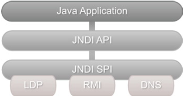

# LDAP 的 Java 支持

- JNDI 基础
- 使用 JNDI 支持 LDAP 的应用程序
- JNDI 缺点

顾名思义，Java 命名和目录接口 (Java Naming and Directory Interface, JNDI) 提供了一个用于访问命名和目录服务的标准化编程接口。这是
通用 API，可用于访问各种系统，包括文件系统、EJB、CORBA 和目录服务，例如网络信息服务和 LDAP。 JNDI 的对目录服务的抽象可以看作类似于 JDBC 对关系数据库的抽象。

JNDI 架构由应用程序编程接口或 API 和服务提供者接口 SPI (Service Provider Interface) 组成。 开发人员使用 JNDI API 对 Java 应用程序进行编程，以访问目录/命名服务(directory/naming services)。 供应商使用处理与其特定服务/产品(service/product)的实际通信的细节来实现 SPI。



自 Java 1.3 版以来，JNDI 一直是标准 JDK 发行版的一部分。API 本身分布在以下四个包中：

- javax.naming 包包含用于在命名服务中查找和访问对象的类和接口。
- javax.naming.directory 包包含扩展核心 javax.naming 包的类和接口。这些类可用于访问目录服务并执行过滤搜索等高级操作。
- javax.naming.event 包在访问命名和目录服务时具有事件通知功能。
- javax.naming.ldap 包包含支持 LDAP 版本 3 控件和操作的类和接口。
- javax.naming.spi 包包含 SPI 接口和类。就像我上面提到的，服务提供者实现了 SPI。

## 使用 JNDI 访问 LDAP

### 连接 LDAP

所有使用 JNDI 的命名和目录操作都是相对于上下文执行的。因此，使用 JNDI 的第一步是创建一个上下文作为 LDAP 服务器上的起点。 这样的上下文被称为初始上下文。 一旦建立了初始上下文，就可以使用它来查找其他上下文或添加新对象。
javax.naming 包中的 Context 接口和 InitialContext 类可用于创建初始命名上下文。若我们要处理的是一个目录，我们将使用一个更具体的 DirContext 接口及其实现 InitialDirContext。 DirContext 和 InitialDirContext 在 javax 中都可用。naming.directory package 可以使用一组提供有关 LDAP 服务器信息的属性来配置目录上下文实例。

在创建上下文期间可能发生的任何问题都将报告为 javax.naming.NamingException 的实例。 NamingException 是 JNDI API 抛出的所有异常的超类。 这是一个检查异常，必须正确处理才能编译代码。 下表列出了我们在 JNDI 开发过程中可能遇到的常见异常。

| Exception                       | Description                                                                                                                                                                                                                                     | ZH                                                           |
|---------------------------------|-------------------------------------------------------------------------------------------------------------------------------------------------------------------------------------------------------------------------------------------------|--------------------------------------------------------------|
| AttributeInUseException         | Thrown when an operation tries to add an existing attribute.                                                                                                                                                                                    | 当操作尝试添加现有属性时抛出。                                              |
| AttributeModification Exception | Thrown when an operation tries to add/remove/ update an attribute and violates the attribute’s schema or state. For example, adding two values to a single valued attribute would result in this exception.                                     | 当操作尝试添加/删除/更新属性并违反属性的架构或状态时抛出。例如，将两个值添加到单个值属性将导致此异常。         |
| CommunicationException          | Thrown when an application fails to communicate (network problems for example) with the LDAP server.                                                                                                                                            | 当应用程序无法与 LDAP 服务器通信（例如网络问题）时引发。                              |
| InvalidAttributesException      | Thrown when an operation tries to add or modify an attribute set that has been specified incompletely or incorrectly. For example, attempting to add a new entry without specifying all the required attributes would result in this exception. | 当操作尝试添加或修改指定不完整​​或不正确的属性集时抛出。例如，在未指定所有必需属性的情况下尝试添加新条目将导致此异常。 |
| LimitExceededException          | Thrown when a search operation abruptly terminates as a user or system specified result limit is reached.                                                                                                                                       | 当搜索操作在达到用户或系统指定的结果限制时突然终止时抛出。                                |
| InvalidSearchFilterException    | Thrown when a search operation is given a malformed search filter.                                                                                                                                                                              | 当为搜索操作提供格式错误的搜索过滤器时抛出。                                       |
| NameAlreadyBoundException       | Thrown to indicate that an entry cannot be added as the associated name is already bound to a different object.                                                                                                                                 | 抛出以指示无法添加条目，因为关联名称已绑定到不同的对象。                                 |
| PartialResultException          | Thrown to indicate that only a portion of the expected results is returned and the operation cannot be completed.                                                                                                                               | 抛出表示只返回了部分预期结果，无法完成操作。                                       |

完成所有所需的 LDAP 操作后，正确关闭上下文和任何其他相关资源非常重要。 关闭 JNDI 资源只需调用它的 close 方法。

## 更新条目

修改现有 LDAP 条目可能涉及以下任何操作：

- 添加新的属性和值，或向现有的多值属性添加新值。
- 替换现有属性值。
- 删除属性及其值。

为了允许修改条目，JNDI 提供了一个恰当命名的 javax。 命名.directory.ModificationItem 类。
ModificationItem 由要进行的修改类型和正在修改的属性组成。

下面的代码创建了一个用于添加新电话号码的修改项。

```Java
Attribute telephoneAttribute = new BasicAttribute("telephone", "80181001000"); 
ModificationItem modificationItem = new ModificationItem(DirContext. ADD_ATTRIBUTE, telephoneAttribute);
```

> 请注意，在上面的代码中，我们使用了常量 ADD_ATTRIBUTE 来指示我们想要一个添加操作。

下表提供了支持的修改类型及其说明。

| Modification Type | Description                                                                                                                                                                                                                                                                                                                                                                              | 描述                                                                                                                         |
|-------------------|------------------------------------------------------------------------------------------------------------------------------------------------------------------------------------------------------------------------------------------------------------------------------------------------------------------------------------------------------------------------------------------|----------------------------------------------------------------------------------------------------------------------------|
| ADD_ATTRIBUTE     | Adds the attribute with the supplied value or values to the entry. If the attribute does not exist then it will be created. If the attribute already exists and the attribute is a multi-valued then this operation simply adds the specified value(s) to the existing list. However, this operation on an existing single valued attributes will result in the AttributeInUseException. | 将具有提供的值的属性添加到条目中。 如果该属性不存在，则将创建该属性。 如果属性已经存在并且属性是多值的，那么这个操作只是简单地将指定的值添加到现有的列表中。 但是，对现有单值属性的此操作将导致 AttributeInUseException。 |
| REPLACE_ATTRIBUTE | Replaces existing attribute values of an entry with the supplied values. If the attribute does not exist then it will be created. If the attribute already exists, then all of its values will be replaced.                                                                                                                                                                              | 用提供的值替换条目的现有属性值。 如果该属性不存在，则将创建该属性。 如果属性已经存在，那么它的所有值都将被替换。                                                                  |
| REMOVE_ATTRIBUTE  | Removes the specified value from the existing attribute. If no value is specified then the attribute in its entirety will be removed. If the specified value does not exist in the attribute, the operation will throw a NamingException. If the value to be removed is the only value of the attribute, then the attribute is also removed.                                             | 从现有属性中删除指定的值。 如果未指定任何值，则将删除整个属性。 如果属性中不存在指定的值，则操作将抛出 NamingException。 如果要删除的值是该属性的唯一值，则该属性也将被删除。                           |

## 搜索条目

搜索信息通常是对 LDAP 服务器执行的最常见操作。 为了执行搜索，我们需要提供搜索范围、我们要查找的内容以及需要返回哪些属性等信息。 在 JNDI 中，此搜索元数据是使用 SearchControls 类提供的。

## JNDI 缺点

尽管 JNDI 为访问目录服务提供了很好的抽象，但它确实存在以下几个缺点：

- 显式资源管理 Explicit Resource Management
  开发者负责关闭所有资源。 这很容易出错，并可能导致内存泄漏。
  The developer is responsible for closing all the resources. This is very error prone and can result in memory leaks.
- 管道规范 Plumbing Code
  我们在上面看到的方法有很多可以轻松抽象和重用的管道代码。 这种管道代码使测试变得更加困难，开发人员必须了解 API 的本质。
  The methods we have seen above have lot of plumbing code that can be easily abstracted and reused. This plumbing code makes testing harder and the developer has to learn the nitty-gritty of the API.
- 检查异常
  检查异常的使用，特别是在不可恢复的情况下是值得怀疑的。 在这些情况下必须显式处理 NamingException 通常会导致空的 try catch 块。
  The usage for checked exceptions especially in irrecoverable situations is questionable. Having to explicitly handle NamingException in those scenario usually results in empty try catch blocks.
