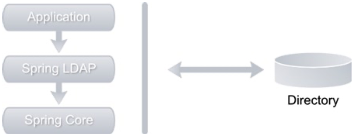

# Spring LDAP



应用程序代码使用 Spring LDAP API 在 LDAP 服务器上执行操作。 Spring LDAP 框架包含所有 LDAP 特定的代码和抽象。 然而，Spring LDAP 将依赖 Spring Framework 来满足其一些基础设施需求。
Spring 框架已成为当今开发基于 Java 的企业应用程序的事实标准。 除此之外，它还提供了一种基于依赖注入的轻量级替代 JEE 编程模型。
Spring 框架是 Spring LDAP 和所有其他 Spring 组合项目（如 Spring MVC 和 Spring Security）的基础。

## 动机

JNDI 的一个显着缺点是它非常冗长，几乎所有代码都与管道有关，而很少与应用程序逻辑有关。 Spring LDAP 通过提供处理管道代码的模板和实用程序类来解决这个问题，以便开发人员可以专注于业务逻辑。
JNDI 的另一个值得注意的问题是它要求开发人员显式管理资源，例如 LDAP 上下文。这很容易出错。忘记关闭资源可能会导致泄漏，并可能在重负载下迅速关闭应用程序。 Spring LDAP 代表您管理这些资源，并在您不再需要它们时自动关闭它们。它还提供了池化 LDAP 上下文的能力，这可以提高性能。
在执行 JNDI 操作期间可能出现的任何问题都将报告为 NamingException 或其子类的实例。 NamingException 是一个检查异常，因此开发人员被迫处理它。数据访问异常通常是不可恢复的，而且大多数情况下没有什么可以做的
捕捉这些异常。为了解决这个问题，Spring LDAP 提供了一个模仿 NamingException 的一致的未经检查的异常层次结构。这允许应用程序设计者选择何时何地处理这些异常。
最后，简单的 JNDI 编程很困难，对新开发人员来说可能会令人生畏。 Spring LDAP 及其抽象使得使用 JNDI 更加愉快。此外，它还提供对象目录映射和事务支持等多种功能，使其成为任何企业 LDAP 开发人员的重要工具。

## 获取 Spring LDAP

在您可以安装和开始使用 Spring LDAP 之前，确保您的机器上已经安装了 Java Development Kit (JDK) 很重要。最新的 Spring LDAP 1.3.2 版本需要 JDK 1.4 或更高版本以及 Spring 2.0 或更高版本。由于我在书中的示例中使用的是 Spring 3.2.4，因此强烈建议安装 JDK 6.0 或更高版本。
Spring Framework 及其组合项目可以从 www.springsource.org/download/community 下载。 Spring LDAP 网站 www.springsource.org/ldap 上提供了直接链接。 Spring LDAP 下载页面允许您下载框架的最新版本和以前版本，如图 3-2 所示。

 LDAP 框架被打包成六个不同的组件。 下表提供了每个组件的简要说明。

| Component Jar           | Description                                                                                                                                               | ZH                                                     |
|-------------------------|-----------------------------------------------------------------------------------------------------------------------------------------------------------|--------------------------------------------------------|
| spring-ldap-core        | Contains all the classes necessary for using the LDAP framework. This jar is required in all the applications.                                            | 包含使用 LDAP 框架所需的所有类。 所有应用程序都需要这个 jar。                   |
| spring-ldap-core-tiger  | Contains classes and extensions that are specific to Java 5 and higher. Applications running under Java 5 should not use this jar.                        | 包含特定于 Java 5 和更高版本的类和扩展。 在 Java 5 下运行的应用程序不应使用此 jar。   |
| spring-ldap-test        | Contains classes and utilities that make testing easier. It also includes classes for starting and stopping in-memory instances of ApacheDS LDAP server.  | 包含使测试更容易的类和实用程序。 它还包括用于启动和停止 ApacheDS LDAP 服务器的内存实例的类。 |
| spring-ldap-ldif-core   | Contains classes for parsing ldif format files.                                                                                                           | 包含用于解析 ldif 格式文件的类。                                    |
| spring-ldap-ldif-batch  | Contains classes necessary to integrate ldif parser解析器 with Spring Batch Framework.                                                                       | 包含将 ldif 解析器与 Spring Batch Framework 集成所需的类。           |
| spring-ldap-odm         | Contains classes for enabling and creating object directory mappings.                                                                                     | 包含用于启用和创建对象目录映射的类。                                     |

除了 Spring Framework，您还需要额外的 jar 文件来使用 Spring LDAP 编译和运行应用程序。 下表列出了其中一些依赖的 jars 文件以及使用它们的原因说明。

| Library Jar     | Description                                                                                                                                                                                                                            | 描述                                                                                                            |
|-----------------|----------------------------------------------------------------------------------------------------------------------------------------------------------------------------------------------------------------------------------------|---------------------------------------------------------------------------------------------------------------|
| commons-lang    | A required jar used internally by Spring LDAP and Spring Framework.                                                                                                                                                                    | Spring LDAP 和 Spring Framework 内部使用的必需 jar。                                                                   |
| commons-logging | Logging abstraction used internally by Spring LDAP and Spring Framework. This is a required jar to be included in applications. An alternative (and advocated by Spring) is to use SLF4J logging framework using the SLF4J-JCL bridge. | Spring LDAP 和 Spring Framework 内部使用的日志记录抽象。这是包含在应用程序中的必需 jar。另一种选择（由 Spring 提倡）是使用 SLF4J 日志框架，使用 SLF4J-JCL 桥。 |
| log4j           | Required library for logging using Log4J.                                                                                                                                                                                              | 使用 Log4J 进行日志记录所需的库。                                                                                          |
| spring-core     | Spring library that contains core utilities used internally by Spring LDAP. This is a required library for using Spring LDAP.                                                                                                          | 包含 Spring LDAP 内部使用的核心实用程序的 Spring 库。这是使用 Spring LDAP 的必需库。                                                   |
| spring-beans    | Spring Framework library used for creating and managing Spring beans. Another library required by Spring LDAP.                                                                                                                         | 用于创建和管理 Spring bean 的 Spring Framework 库。 Spring LDAP 需要的另一个库。                                                |
| spring-context  | Spring library that is responsible for dependency injection. This is required when using Spring LDAP inside a Spring application.                                                                                                      | 负责依赖注入的 Spring 库。在 Spring 应用程序中使用 Spring LDAP 时，这是必需的。                                                        |
| spring-tx       | Spring Framework library that provides transaction abstractions. This is required when using Spring LDAP transaction support.                                                                                                          | 提供事务抽象的 Spring Framework 库。在使用 Spring LDAP 事务支持时这是必需的。                                                        |
| spring-jdbc     | Library that simplifies access to database using JDBC under the covers. This is an optional library and should be used for transaction support.                                                                                        | 使用 JDBC 在后台简化对数据库的访问的库。这是一个可选库，应该用于事务支持。                                                                      |
| commons-pool    | Apache Commons Pool library provides support for pooling. This should be included when using Spring LDAP pooling support.                                                                                                              | Apache Commons Pool 库提供对池的支持。使用 Spring LDAP pooling 支持时应该包括这一点。                                               |
| ldapbp          | Sun LDAP booster pack that includes additional LDAP V3 Server controls. This jar is needed when you are planning to use these additional controls or running under Java 5 or lower.                                                    | Sun LDAP 增强包，包括附加的 LDAP V3 服务器控件。当您计划使用这些附加控件或在 Java 5 或更低版本下运行时，需要此 jar。                                     |

Spring LDAP 项目使用 Git 作为其源代码控制系统。 源码可以从 <https://github.com/SpringSource/spring-ldap> 下载。
Spring LDAP 源代码可以为框架架构提供有价值的见解。 它还包括一个丰富的测试套件，可以用作附加文档并帮助您理解框架。 我强烈建议您下载并查看源代码。 Git 存储库还包含一个沙盒文件夹，其中包含几个可能会或可能不会进入框架的实验性功能。

## Spring LDAP Archetypes

为了快速启动 Spring LDAP 开发，本书使用了以下两种原型：

- actual-ldap-empty-archetype：此原型可用于创建具有所有必需 LDAP 依赖项的空 Java 项目。
- actual-ldap-archetype：与上述原型类似，此原型创建一个具有所有必需 LDAP 依赖项的 Java 项目。 此外，它还包括 Spring LDAP 配置文件、示例代码和依赖项，以运行内存中的 LDAP 服务器以进行测试。

在您可以使用原型创建项目之前，您需要安装它们。在下载的发行版中，您会找到实用的ldap-empty-archetype-1.0.0.jar 和实用的ldap-archetype-1.0.0.jar 原型。 下载 jar 文件后，在命令行运行以下两个命令：

```bash
mvn install:install-file \ -DgroupId=com.inflinx.book.ldap \ -DartifactId=practical-ldap-empty-archetype \ -Dversion=1.0.0 \
-Dpackaging=jar -Dfile=<JAR_LOCATION_DOWNLOAD>/practical-ldap-empty-archetype-1.0.0.jar

mvn install:install-file \ -DgroupId=com.inflinx.book.ldap \ -DartifactId=practical-ldap-archetype \ -Dversion=1.0.0 \
-Dpackaging=jar
-Dfile=< JAR_LOCATION_DOWNLOAD >/practical-ldap-archetype-1.0.0.jar
```

这些 maven install 命令将在您的本地 maven 存储库中安装这两个原型。 使用这些原型之一创建项目只需运行以下命令：

```bash
C:\practicalldap\code>mvn archetype:generate -DarchetypeGroupId=com.inflinx.book.ldap \ -DarchetypeArtifactId=practical-ldap-empty-archetype \ -DarchetypeVersion=1.0.0 \
-DgroupId=com.inflinx.ldap \ -DartifactId=chapter3 \ -DinteractiveMode=false
```

请注意，此命令在目录 c:/practicalldap/code 中执行。 该命令指示 maven 使用原型实用 ldap-empty-archetype 并生成一个名为 chapter3 的项目。
此项目的目录结构有一个 src 文件夹，其中包含所有代码和任何相关资源，例如 XML 文件。 目标文件夹包含生成的类和构建工件。 src 下的主文件夹通常包含最终进入生产环境的代码。 test 文件夹包含相关的测试代码。 这两个文件夹中的每一个都包含 java 和 resources 子文件夹。 顾名思义，java 文件夹包含 Java 代码，而 resources 文件夹通常包含配置 xml 文件。
根文件夹中的 pom.xml 文件保存了 Maven 所需的配置信息。

### Maven

Maven 需要一个 组(group) id 和 工件(artifact) id 来唯一标识一个依赖项。组 id 通常对项目或组织是唯一的，类似于 Java 包的概念。工件 id 通常是项目的名称或项目的生成组件。范围决定了依赖项应该包含在类路径中的阶段。以下是几个可能的值：

- test：测试范围表明依赖关系应该仅在测试过程中包含在类路径中。 JUnit 就是这种依赖的一个例子。
- provided：提供的范围表明该工件仅应在编译期间包含在类路径中。提供的范围依赖通常在运行时通过 JDK 或应用程序容器可用。
  The provided scope indicates that the artifact should be included in the classpath during compilation only. Provided scope dependencies are usually available at runtime via JDK or application container.
- compile：编译范围表示依赖项应始终包含在类路径中。

pom.xml 文件中的附加部分包含有关 Maven 可用于编译和构建代码的插件的信息。 finalName 表示生成的工程的名称。

要构建这个生成的应用程序，只需从命令行运行以下命令。 此命令清理目标文件夹，编译源文件，并在目标文件夹中生成一个 jar 文件。

`mvn  clean  compile package`

## LDAP 服务器设置

### opendJ 安装

安装 LDAP 服务器来测试您的 LDAP 代码。 在可用的开源 LDAP 服务器中，OpenDJ 非常易于安装和配置。
> 注意 即使您已经有可用的测试 LdAP 服务器，我强烈建议您按照以下步骤安装 opendJ LdAP 服务器。 您将大量使用此实例来测试本书中的代码。

从 <https://www.openidentityplatform.org/opendj> 下载 [OpenDJ](https://github.com/OpenIdentityPlatform/OpenDJ/releases/download/4.5.0/opendj-4.5.0.zip) 分发文件，后直接[安装](https://github.com/OpenIdentityPlatform/OpenDJ/wiki/Installation-Guide)。

[从 Docker 运行 OpenDJ](https://hub.docker.com/r/openidentityplatform/opendj/)

```bash
~ % docker run -h ldap-01.inflinx.com -p 1389:1389 -p 1636:1636 -p 4444:4444 --name ldap-01 openidentityplatform/opendj \
--env BASE_DN="dc=inflinx,dc=com" \
--env ROOT_USER_DN="root" \
--env ROOT_PASSWORD="wangkan77"

Instance data Directory is empty. Creating new DJ instance
BASE DN is dc=example,dc=com
Password set to password
Running /opt/opendj/bootstrap/setup.sh
Setting up default OpenDJ instance

Configuring Directory Server ..... Done.
Configuring Certificates ..... Done.
Creating Base Entry dc=example,dc=com ..... Done.

To see basic server configuration status and configuration, you can launch
/opt/opendj/bin/status
```

```bash
docker run -it --rm --entrypoint /opt/opendj/bin/import-ldif \
-v patrons.ldif:/opt/opendj/import-data/patrons.ldif openidentityplatform/opendj \ 
-b dc=inflinx,dc=com \
-D 'cn=Directory Manager' \
-h opendj -p 1389 -w passw0rd \
-l /opt/opendj/import-data/patrons.ldif
```

### opendJ 设置

服务器设置，将侦听器端口从 389 更改为 11389，将管理连接器端口从 4444 更改为 4445。并使用 opendj 作为密码
在拓扑选项，保留“standalone server””选项。
在 Directory Data ，输入值“dc=inflinx,dc=com”作为 Directory Base DN。

### 安装 Apache Directory Studio

Apache Directory Studio 是一种流行的开源 LDAP 浏览器，可以帮助您非常轻松地浏览 LDAP 目录。要安装 Apache Directory Studio，请从以下位置下载安装程序文件 <http://directory.apache.org/studio/downloads.html>。

[在macOS中安装](https://directory.apache.org/studio/download/download-macosx.html)

配置LDAP链接。

> Error:`[LDAP result code 34 - invalidDNSyntax] invalid DN`
可能是密码不对引起

## 加载测试数据

在前面的部分中，您安装了 OpenDJ LDAP 服务器和 Apache Directory Studio 以访问 LDAP 服务器。 设置开发/测试环境的最后一步是使用测试数据加载 LDAP 服务器。
> 注意 随附的源代码/下载包含两个 LdIF 文件，patrons.ldif 和 employees.ldif。 顾客.ldif 文件包含模拟图书馆顾客的测试数据。 employees.ldif 文件包含模拟图书馆员工的测试数据。

以下是加载测试数据的步骤。

1. 在 LDAP 浏览器窗格中右键单击“Root DSE”并选择`Import ➤ LDIF Import`
2. 浏览这个patans.ldif 文件并点击Finish 按钮。 确保选中“Update existing entries”复选框。
3. 成功导入后，您将看到 dc=inflinx,dc=com 条目下加载的数据。

> Error: `[LDAP result code 53 - unwillingToPerform] no global superior knowledge`.
可能是没有配置相应的dn引起。

## 搜索客户端示例

编写一个简单的搜索客户端(SearchClient.java)，它读取 ou=patrons LDAP 分支中的所有读者姓名。
Spring LDAP 框架的核心是 org.springframework.ldap.core.LdapTemplate 类。基于模板方法设计模式 (<http://en.wikipedia.org/wiki/Template_method_pattern>)，LdapTemplate 类负责 LDAP 编程中涉及的不必要的管道。它提供了许多重载的搜索、查找、绑定、验证和取消绑定方法，使 LDAP 开发变得轻而易举。 LdapTemplate 是线程安全的，并发线程可以使用相同的实例。

Spring LdAP 1.3 版引入了 LdapTemplate 的一个变体，称为 SimpleLdapTemplate。 这是经典 LdapTemplate 的基于 Java 5 的便捷包装器。 SimpleLdapTemplate 将 Java 5 泛型支持添加到查找和搜索方法。 这些方法现在将 `ParameterizedContextMapper<T>` 的实现作为参数，允许搜索和查找方法返回类型化对象(typed objects)。
SimpleLdapTemplate 仅公开 LdapTemplate 中可用操作的子集。但是，这些操作是最常用的操作，因此 SpringLdapTemplate 在很多情况下就足够了。 SimpleLdapTemplate 还提供 getLdapOperations() 方法，该方法公开包装的 LdapOperations 实例，并可用于调用不太常用的模板方法。

通过获取 LdapTemplate 类的实例来启动搜索方法实现。然后调用 LdapTemplate 搜索方法的变体。搜索方法的第一个参数是 LDAP 基础，第二个参数是搜索过滤器。 search 方法使用 base 和 filter 执行搜索，获得的每个 javax.naming.directory.SearchResult 都提供给实现
作为第三个参数提供的 org.springframework.ldap.core.AttributesMapper 。AttributesMapper 的实现是通过创建一个匿名类来实现的，该类读取每个 SearchResult 条目并返回条目的通用名称。
为了使 LdapTemplate 正确执行搜索，它需要 LDAP 服务器上的初始上下文。 Spring LDAP 提供了 org.springframework.ldap.core.ContextSource 接口抽象及其实现 org.springframework.ldap.core.support。 LdapContextSource 用于配置和创建上下文实例。
通过创建一个新的 LdapContextSource 并使用有关 LDAP 服务器的信息（例如服务器 URL 和绑定凭据）填充它来开始方法实现。 然后调用允许 Spring LDAP 执行内务操作的 Context Source 上的 afterPropertiesSet 方法。 最后，您创建一个新的 LdapTemplate 实例并传入新创建的上下文源。

## Spring 应用程序上下文

每个 Spring Framework 应用程序的核心是 ApplicationContext 的概念。 这个接口的实现负责创建和配置 Spring bean。 应用程序上下文还充当 IoC 容器并负责执行依赖注入。 Spring bean 只是一个标准 POJO，其中包含在 Spring 容器内运行所需的元数据。
在标准 Spring 应用程序中，ApplicationContext 是通过 XML 文件或 Java 注释配置的。 applicationContext.xml 显示了一个带有一个 bean 声明的示例应用程序上下文文件。 bean myBean 的类型为 com.inflinx.book.ldap.SimplePojo。 当应用程序加载上下文时，Spring 创建一个 SimplePojo 实例并对其进行管理。

## Spring 驱动的搜索客户端

我们对搜索客户端实现的转换见 applicationContext.xml 文件。

在上下文文件中，您声明一个 contextSource bean 来管理与 LDAP 服务器的连接。 为了让 LdapContextSource 正确创建 DirContext 的实例，您需要向它提供有关 LDAP 服务器的信息。 url 属性将完全限定的 URL（ldap://server:port 格式）带到 LDAP 服务器。 base 属性可用于指定所有 LDAP 操作的根后缀。 userDn 和 password 属性用于提供身份验证信息。 接下来，您配置一个新的 LdapTemplate bean 并注入 contextSource bean。
在上下文文件中声明了所有依赖项后，可以重新实现搜索客户端，见SpringSearchClient.java。

此代码将 LdapTemplate 的创建提取到外部配置文件。 @Autowired 注解指示 Spring 注入 ldapTemplate 依赖项。这极大地简化了搜索客户端类，并帮助您专注于搜索逻辑。
首先创建一个新的 ClassPathXmlApplicationContext 实例。 这 ClassPathXmlApplicationContext 将 applicationContext.xml 文件作为其范围。 然后您从上下文中检索 SpringSearchClient 的实例并调用搜索方法。

## Spring LdapTemplate 操作

使用 LdapTemplate 在 LDAP 中添加、删除和修改信息。

### 添加操作

LdapTemplate 类提供了几个绑定方法，允许您创建新的 LDAP 条目。其中最简单的方法如下：
`public void bind(String dn, Object obj, Attributes attributes)`
此方法的第一个参数是需要绑定的对象的唯一可分辨名称。第二个参数是要绑定的对象，通常是 DirContext 接口的实现。第三个参数是要绑定的对象的属性。这三个中，只有第一个参数是必需的，其余两个可以传递 null。
通过创建 BasicAttributes 类的新实例来保存读者属性。通过将属性名称和值传递给 put 方法来添加单值属性。要添加多值属性对象类，请创建 BasicAttribute 的新实例。然后将条目的 objectClass 值添加到 objectClassAttribute 并将其添加到属性列表中。最后，使用读者信息和读者的完全限定 DN 调用 LdapTemplate 上的绑定方法。这会将读者条目添加到 LDAP 服务器。

### 修改操作

考虑您要向新添加的顾客添加电话号码的场景。 为此，LdapTemplate 提供了一个方便的 modifyAttributes 方法，其签名如下：
`public void modifyAttributes(String dn, ModificationItem[] mods)`
modifyAttributes 方法的这种变体将要修改的条目的完全限定唯一 DN 作为其第一个参数。 第二个参数接受一个ModificationItems数组，其中每个修改项保存需要修改的属性信息。

在这个实现中，您只需创建一个新的 BasicAttribute 电话信息。 然后你新建一个ModificationItem并传入ADD_ATTRIBUTE代码，表示你正在添加一个属性。 最后，您调用 带有读者 DN 和修改项目的 modifyAttributes 方法。 DirContext 有一个 REPLACE_ATTRIBUTE 代码，使用时将替换属性的值。 同样，REMOVE_ATTRIBUTE 代码将从属性中删除指定的值。

### 删除操作

与添加和修改类似，LdapTemplate 使用 unbind 方法可以轻松删除条目。
