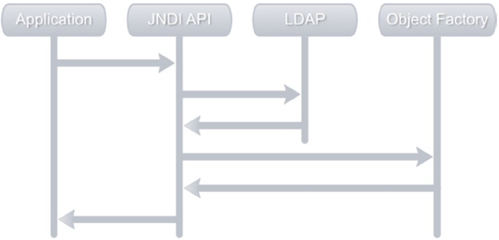

# Advanced Spring LDAP

- JNDI 对象工厂的基础知识。
- 使用对象工厂的DAO 实现。

## JNDI 对象工厂

JNDI 提供了对象工厂的概念，这使得处理 LDAP 信息更加容易。 顾名思义，对象工厂将目录信息转换为对应用程序有意义的对象。 例如，使用对象工厂可以让搜索操作返回对象实例，例如 Patron 或 Employee，而不是普通的 javax.naming.NamingEnumeration。

下图描述了应用程序执行 LDAP 操作时所涉及的流程：

与对象工厂结合使用。 该流程从应用程序调用搜索或查找操作开始。 JNDI API 将执行请求的操作并从 LDAP 检索条目。 然后将这些结果传递给已注册的对象工厂，后者将它们转换为对象。 这些对象被移交给应用程序。

处理 LDAP 的对象工厂需要实现 javax.naming.spi。 DirObjectFactory 接口。 PatronObjectFactory.java 显示了一个 Patron 对象工厂实现，它接受传入的信息并创建一个 Patron 实例。 getObjectInstance 方法的 obj 参数保存有关对象的引用信息。 name 参数保存对象的名称。 attrs 参数包含与对象关联的属性。 在 getObjectInstance 中，您读取所需的属性并填充新创建的 Patron 实例。

在开始使用此对象工厂之前，必须在初始上下文创建期间对其进行注册。 JndiObjectFactoryLookupExample.java 显示了在查找期间使用 PatronObjectFactory 的示例。 您使用 DirContext.OBJECT_FACTORIES 属性注册 PatronObjectFactory 类。 请注意，上下文的查找方法现在返回一个 Patron 实例。

## Spring and Object Factories

Spring LDAP 提供了一个开箱即用的 DirObjectFactory 实现，称为 org.springframework.ldap.core.support.DefaultDirObjectFactory。上一节中，PatronObjectFactory 从找到的上下文中创建 Patron 实例。同样， DefaultDirObjectFactory 从找到的上下文中创建 org.springframework.ldap.core.DirContextAdapter 的实例。
DirContextAdapter 类本质上是通用的，可以被视为 LDAP 条目数据的持有者。 DirContextAdapter 类提供了多种实用方法，极大地简化了获取和设置属性。正如您将在后面的部分中看到的，当对属性进行更改时，DirContextAdapter 会自动跟踪这些更改并简化更新 LDAP 条目的数据。 DirContextAdapter 和 DefaultDirObjectFactory 的简单性使您能够轻松地将 LDAP 数据转换为域对象，从而减少编写和注册大量对象工厂的需要。
在接下来的部分中，您将使用 DirContextAdapter 创建一个 Employee DAO，该 DAO 抽象了 Employee LDAP 条目的读写访问。

### DAO design pattern

如今，大多数 Java 和 JEE 应用程序都访问某种类型的持久性存储以进行日常活动。 持久存储从流行的关系数据库到 LDAP 目录再到遗留大型机系统各不相同。 根据持久存储的类型，获取和操作数据的机制会有很大差异。 这可能导致应用程序和数据访问代码之间的紧密耦合，从而难以在实现之间切换。 这是数据访问对象或 DAO 模式可以提供帮助的地方。
数据访问对象data Access Object是一种流行的核心 JEE 模式，它封装了对数据源的访问。 低级数据访问逻辑（例如连接到数据源和操作数据）被 DAO 干净地抽象到单独的层。 一个 dAO 实现通常包括以下内容：

1. 提供 CRUD 方法契约的 DAO 接口。
2. 使用特定于数据源的 API 的接口的具体实现。
3. DAO返回的领域对象或传输对象domain objects or transfer objects。

有了 DAO，应用程序的其余部分就不必担心底层数据实现，而可以专注于高级业务逻辑。

### 使用对象工厂Object Factories实现 DAO

通常，您在 Spring 应用程序中创建的 DAO 具有用作 DAO 合约的接口和包含访问数据存储或目录的实际逻辑的实现。 EmployeeDao.java 显示了您将要实现的 Employee DAO 的 EmployeeDao 接口。 DAO 具有用于修改员工信息的创建、更新和删除方法。 它还有两种查找方法，一种通过 id 检索员工，另一种返回所有员工。

之前的 EmployeeDao 接口使用 Employee 域对象。 Employee.java 显示了这个 Employee 域对象。 Employee 实现包含图书馆员工的所有重要属性。 请注意，您将使用 uid 属性作为对象的唯一标识符，而不是使用完全限定的 DN。

从 EmployeeDao 的基本实现开始，如 EmployeeDaoLdapImpl.java 所示。
在此实现中，您将注入 SimpleLdapTemplate 的一个实例。
SimpleLdapTemplate 的实际创建将在外部配置文件中完成， 即带有 SimpleLdapTemplate 和相关 bean 声明 repositoryContext.xml 文件。
该配置文件中，您将 LDAP 服务器信息提供给 LdapContextSource 以创建 contextSource bean。通过将基数设置为“ou=employees,dc=inflinx,dc=com”，您已将所有 LDAP 操作限制在 LDAP 树的员工分支中。重要的是要了解使用此处创建的上下文将无法对分支“ou=patrons”进行搜索操作。如果要求搜索 LDAP 树的所有分支，则基本属性需要为空字符串。
LdapContextSource 的一个重要属性是 dirObjectFactory，可用于设置要使用的 DirObjectFactory。然而，在示例文件中，您没有使用此属性来指定您使用 DefaultDirObjectFactory 的意图。这是因为默认情况下 LdapContextSource 将 DefaultDirObjectFactory 注册为其 DirObjectFactory。
在配置文件的最后部分，您有 SimpleLdapTemplate bean 声明。您已将 LdapContextSource bean 作为构造函数参数传递给 SimpleLdapTemplate。

### 实现查找器方法

实现 Employee DAO 的 findAll 方法需要在 LDAP 中搜索所有员工条目并使用返回的条目创建 Employee 实例。 为此，您将在 SimpleLdapTemplate 类中使用以下方法：
`public <T> List<T> search(String base, String filter, ParameterizedContextMapper<T> mapper)`

由于您使用的是 DefaultDirObjectFactory，因此每次执行搜索或查找时，在 LDAP 树中找到的每个上下文都将作为 DirContextAdapter 的实例返回。 搜索方法接受一个基本参数和过滤器参数。 此外，它采用 `ParameterizedContextMapper<T>` 的实例。 搜索方法会将返回的 DirContextAdapters 传递给 `ParameterizedContextMapper<T>` 实例进行转换。
`ParameterizedContextMapper<T>` 及其父接口 ContextMapper 保存从传入的 DirContextAdapter 填充域对象所需的映射逻辑。

EmployeeContextMapper.java 提供了用于映射 Employee 实例的上下文映射器实现。 可以看到，EmployeeContextMapper扩展了AbstractParameterizedContextMapper，这是一个实现ParameterizedContextMapper的抽象类。
其中 doMapFromContext 方法的 DirContextOperations 参数是 DirContextAdapter 的接口。 如您所见，doMapFromContext 实现涉及创建一个新的 Employee 实例并从提供的上下文中读取您感兴趣的属性。
有了 EmployeeContextMapper，findAll 方法的实现就变得微不足道了。 由于所有员工条目都有 objectClass inetOrgPerson，因此您将使用“(objectClass=inetOrgPerson)”作为搜索过滤器。 EmployeeDaoLdapImpl.java 显示了 findAll 的实现。

另一种查找器方法可以通过两种方式实现：使用过滤器 `(uid=<supplied employee id>)` 搜索 LDAP 树或使用员工 DN 执行 LDAP 查找。 由于使用过滤器的搜索操作比查找 DN 更昂贵，因此您将使用查找来实现 find 方法。 EmployeeDaoLdapImpl.java 显示了 find 方法的实现。

您通过为员工构造一个 DN 来开始实施。 由于初始上下文库仅限于员工分支，因此您刚刚指定了员工条目的 RDN 部分。 然后使用查找方法查找员工条目并使用 EmployeeContextMapper 创建一个 Employee 实例。
这结束了两种查找器方法的实现。 让我们创建一个 JUnit 测试类来测试您的 finder 方法。 测试用例如 EmployeeDaoLdapImplTest.java 所示。

请注意，您已在 ContextConfiguration 中指定了 repositoryContext-test.xml。 在配置文件中，创建了嵌入式上下文源。 嵌入式 LDAP 服务器是 OpenDJ 的一个实例（由属性 serverType 指定），将在端口 12389 上运行。
JUnit 测试用例中的 setup 和 teardown 方法用于加载和删除测试员工数据。 employee.ldif 文件包含您将在本书中使用的测试数据。

### 创建方法

SimpleLdapTemplate 提供了几种绑定方法来将条目添加到 LDAP。 去创造
一个新员工，您将使用以下绑定方法变体：
`public void bind(DirContextOperations ctx)`
此方法将 DirContextOperations 实例作为其参数。 bind 方法在传入的 DirContextOperations 实例上调用 getDn 方法并检索条目的完全限定 DN。 然后它将所有属性绑定到 DN 并创建一个新条目。

Employee DAO 中 create 方法的实现如 EmployeeDaoLdapImpl.java 所示。 如您所见，您首先创建一个 DirContextAdapter 的新实例。
然后，您使用员工信息填充上下文的属性。 请注意
departmentNumber 的 int 值被显式转换为字符串。 如果未完成此转换，该方法将最终抛出“org.springframework. ldap.InvalidAttributeValueException”异常。 该方法的最后一行执行实际绑定。

> 注意 DirContextAdapter 在简化属性操作方面做得很好。

让我们用 EmployeeDaoLdapImplTest.java 中的 JUnit 测试用例快速验证 create 方法的实现。

### 更新方法

更新条目涉及添加、替换或删除其属性。 实现这一点的最简单方法是删除整个条目并使用一组新属性创建它。 这种技术称为重新绑定。 删除和重新创建条目显然效率不高，仅对更改的值进行操作更有意义。
在第 3 章中，您使用了 modifyAttributes 和 ModificationItem 实例来更新 LDAP 条目。 尽管 modifyAttributes 是一个不错的方法，但手动生成 ModificationItem 列表确实需要大量工作。 值得庆幸的是，DirContextAdapter 可以自动执行此操作，并使更新条目变得轻而易举。 EmployeeDaoLdapImpl.java 显示了使用 DirContextAdapter 的更新方法实现。

在这个实现中，您会注意到您首先使用员工的 DN 查找现有上下文。 然后像在 create 方法中一样设置所有属性。 （区别在于 DirContextAdapter 跟踪对条目所做的值更改。）最后，您将更新的上下文传递给 modifyAttributes 方法。 modifyAttributes 方法将从 DirContextAdapter 检索修改的项目列表，并对 LDAP 中的条目执行这些修改。 EmployeeDaoLdapImplTest.java 中的 testUpdate() 显示了更新员工名字的关联测试用例。

### 删除方法

Spring LDAP 使用 LdapTemplate/SimpleLdapTemplate 中的 unbind 方法简化了绑定。 EmployeeDaoLdapImpl.java 中的 delete(String id) 显示了删除员工所涉及的代码。

由于您的操作都与以“ou=employees,dc=inflinx,dc=com”为基础的初始上下文相关，因此您只需使用条目的 RDN uid 创建 DN。 调用 unbind 操作将删除该条目及其所有相关属性。
EmployeeDaoLdapImplTest.java 中的 testDelete() 显示了用于验证条目删除的关联测试用例。 成功删除条目后，对该名称的任何查找操作都将导致 NameNotFoundException。 测试用例验证了这个假设。
