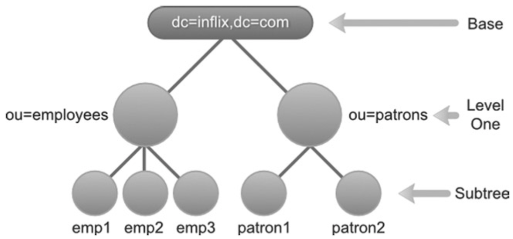
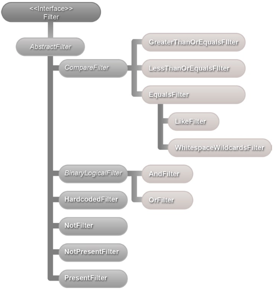

# Searching LDAP

- LDAP 搜索的基础知识
- 使用过滤器的 LDAP 搜索
- 创建自定义搜索过滤器
搜索信息是针对 LDAP 执行的最常见操作。
客户端应用程序通过传入搜索条件（确定搜索位置和搜索内容的信息）来启动 LDAP 搜索。收到请求后，LDAP 服务器执行搜索并返回所有符合条件的条目。

## LDAP 搜索条件

LDAP 搜索条件由三个强制参数组成——base、scope 和 filter 以及几个可选参数。

### 基本 Base 参数

搜索的基本部分是标识将要搜索的树的分支的专有名称 Distinguished Name (DN)。例如，“ou=patrons, dc=inflinx, dc=com”的基本名称表示搜索将从 Patron 分支开始并向下移动。也可以指定一个空基，这将导致搜索根 root DSE 条目。
> 注意 root DSE 或 DSA-Specific Entry 是 LDAP 服务器中的特殊条目。 它通常包含特定于服务器的数据，例如供应商名称、供应商版本以及它支持的不同控件和功能。

## 范围参数

范围参数确定需要执行 LDAP 搜索相对于基础的深度。 LDAP 协议定义了三种可能的搜索范围：基础、一级和子树。下图说明了在不同范围的搜索中评估的条目。


基本范围将搜索限制为由基本参数标识的 LDAP 条目。搜索中不会包含其他条目。在您的图书馆应用程序模式中，使用 base DN dc=inflinx,dc=com 和基本范围，搜索将只返回根组织条目，如上图所示。

一级范围表示搜索直接低于基础的一级的所有条目。基本条目本身不包括在搜索中。因此，使用基本 base dc=inflinx,dc=com 和一级范围，搜索所有条目将返回员工和顾客组织单位。
最后，子树范围包括搜索中的基本条目及其所有后代条目。这是三者中最慢和最昂贵的选择。在您的图书馆示例中，使用此范围和 base dc=inflinx, dc=com 的搜索将返回所有条目。

## 过滤器参数

在您的图书馆应用程序 LDAP 服务器中，假设您要查找居住在 Midvale 地区的所有顾客。 从 LDAP 模式中，您知道顾客条目具有包含其居住城市名称的城市属性。因此，此要求本质上归结为检索所有城市属性值为“Midvale”的条目。 这正是搜索过滤器的作用。 搜索过滤器定义了所有返回条目所具有的特征。 从逻辑上讲，过滤器被应用到由 base 和 scope 标识的集合中的每个条目。 只有与过滤器匹配的条目才会成为返回的搜索结果的一部分。

LDAP 搜索过滤器由三个组件组成：属性类型、运算符和属性的值（或值范围）。根据运算符，值部分可以是可选的。这些组件必须始终括在括号内，如下所示：
`Filter = (attributetype operator value)`
有了这些信息，查找居住在 Midvale 的所有顾客的搜索过滤器将如下所示：
`(city=Midvale)`
现在，假设您想找到住在 Midvale 地区并拥有一个电子邮件地址的所有顾客，以便您可以向他们发送图书馆偶尔活动的消息。生成的搜索过滤器本质上是两个过滤器项目的组合：一个项目标识米德维尔市的顾客，另一个项目标识有电子邮件地址的顾客。您已经看到了过滤器的第一项。这是过滤器的另一部分：
`(mail=*)`
`=*` 运算符表示存在属性。所以表达式 `mail=*` 将返回所有在其邮件属性中具有值的条目。 LDAP 规范定义了可用于组合多个过滤器和创建复杂过滤器的过滤器运算符。以下是组合过滤器的格式：
`Filter = (operator filter1 filter2)`
请注意前缀表示法的使用，其中运算符写在操作数之前，用于组合两个过滤器。这是您的用例所需的过滤器：
`(&(city=Midvale)(mail=*))`
此过滤器中的 & 是 And 运算符。 LDAP 规范定义了多种搜索过滤器操作符。

Table 6-1. Search Filter Operators。

| Name                           | Symbol  | Example                    | Description                                                                                                                  |
|--------------------------------|---------|----------------------------|------------------------------------------------------------------------------------------------------------------------------|
| Equality Filter                | =       | (sn=Smith)                 | Matches all the entries with last name Smith.                                                                                |
| Substring Filter               | =, *    | (sn=Smi*)                  | Matches all entries whose last name begins with Smi.                                                                         |
| Greater Than or Equals Filter  | >=      | (sn>=S*)                   | Matches all entries that are alphabetically greater than or equal to S.                                                      |
| Less Than or Equals Filter     | <=      | (sn<=S*)                   | Matches all entries that are alphabetically lower than or equals to S.                                                       |
| Presence Filter                | =*      | (objectClass=*)            | Matches all entries that have the attribute objectClass. This is a popular expression used to retrieve all entries in LDAP.  |
| Approximate Filter             | ~=      | (sn~=Smith)                | Matches all entries whose last name is a variation of Smith. So this can return Smith and Snith.                             |
| And Filter                     | &       | (&(sn=Smith) (zip=84121))  | Returns all Smiths living in the 84121 area.                                                                                 |
| Or Filter                      | /|/     | (|(sn=Smith) (sn=Lee))     | Returns all entries with last name Smith or Lee.                                                                             |
| Not Filter                     | !       | (!(sn=Smith))              | Returns all entries whose last name is not Smith.                                                                            |

可选参数
除了上述三个参数之外，还可以包含几个可选参数来控制搜索行为。例如，timelimit 参数表示允许完成搜索的时间。同样， sizelimit 参数为可以作为结果的一部分返回的条目数设置了上限。
一个非常常用的可选参数涉及提供属性名称列表。执行搜索时，LDAP 服务器默认返回与在搜索中找到的条目关联的所有属性。有时这可能是不可取的。在这些情况下，您可以提供属性名称列表作为搜索的一部分，LDAP 服务器将仅返回具有这些属性的条目。以下是 LdapTemplate 中的搜索方法示例，该方法采用属性名称数组（ATTR_1、ATTR_2 和 ATTR_3）：
`ldapTemplate.search("SEARCH_BASE", "uid=USER_DN", 1, new String[]{"ATTR_1", "ATTR_2", ATTR_3}, new SomeContextMapperImpl());`
执行此搜索时，返回的条目将只有 ATTR_1、ATTR_2 和 ATTR_3。这可以减少从服务器传输的数据量，并且在高流量情况下很有用。
从版本 3 开始，LDAP 服务器可以维护每个条目的属性，以实现纯粹的管理目的。这些属性称为操作属性，不是条目对象类的一部分。执行 LDAP 搜索时，默认情况下返回的条目将不包含操作属性。为了检索操作属性，您需要在搜索条件中提供操作属性名称列表。

> 注意 操作属性的示例包括 createTimeStamp（保存条目创建时间）和 pwdAccountLockedTime（记录用户帐户被锁定的时间）。

## LDAP INJECTION

LDAP 注入是一种攻击者更改 LDAP 查询以针对目录服务器运行任意 LDAP 语句的技术。 LDAP 注入可能导致未经授权的数据访问或对 LDAP 树的修改。不执行正确的输入验证或清理输入的应用程序很容易受到 LDAP 注入。这种技术类似于用于数据库的流行 SQL 注入攻击。
为了更好地理解 LDAP 注入，请考虑使用 LDAP 进行身份验证的 Web 应用程序。这样的应用程序通常提供一个网页，让用户输入他的用户名和密码。为了验证用户名和密码是否匹配，应用程序将构建一个 LDAP 搜索查询，看起来或多或少像这样：
`(&(uid=USER_INPUT_UID)(password=USER_INPUT_PWD))`
让我们假设应用程序只是信任用户输入并且不执行任何验证。现在，如果您输入文本 `jdoe)(&))(` 作为用户名并输入任何随机文本作为密码，则生成的搜索查询过滤器将如下所示：
`(&(uid=jdoe)(&))((password=randomstr))`
如果用户名 jdoe 是 LDAP 中的有效用户 ID，那么无论输入的密码如何，此查询将始终评估为 true。这种 LDAP 注入将允许攻击者绕过身份验证并进入应用程序。 “LDAP Injection
& Blind LDAP Injection”文章可在 <http://www.blackhat.com/presentations/bh-europe-08/Alonso-Parada/Whitepaper/bh-eu-08-alonso-parada-WP.pdf> 中详细讨论各种 LDAP 注入技术。
开始防止 LDAP 注入以及任何其他一般的注入技术
通过适当的输入验证。在将其用于搜索过滤器之前，对输入的数据进行清理并对其进行正确编码非常重要。

## Spring LDAP 过滤器

在上一节中，您了解到 LDAP 搜索过滤器对于缩小搜索范围和识别条目非常重要。但是，动态创建 LDAP 过滤器可能很乏味，尤其是在尝试组合多个过滤器时。确保所有大括号都正确闭合可能容易出错。正确转义特殊字符也很重要。
Spring LDAP 提供了几个过滤器类，可以轻松创建和编码 LDAP 过滤器。所有这些过滤器都实现了 Filter 接口并且是 org.springframework.ldap.filter 包的一部分。下面的清单显示了过滤器 API 接口。

```java
package org.springframework.ldap.filter;
public interface Filter {
   String encode();
   StringBuffer encode(StringBuffer buf);
   boolean equals(Object o);
   int hashCode();
}
```

此接口中的第一个 encode 方法返回过滤器的字符串表示形式。第二个编码方法接受一个 StringBuffer 作为其参数，并将过滤器的编码版本作为 StringBuffer 返回。对于您的常规开发过程，您使用返回 String 的第一个版本的 encode 方法。
Filter 接口层次结构如下图所示。从层次结构中，您可以看到 AbstractFilter 实现了 Filter 接口并充当所有其他过滤器实现的根类。 BinaryLogicalFilter 是二元逻辑运算（例如 AND 和 OR）的抽象超类。 CompareFilter 是用于比较 EqualsFilter 和 LessThanOrEqualsFilter 等值的过滤器的抽象超类。



> 注意 默认情况下，大多数 LDAP 属性值对搜索不区分大小写。

在接下来的部分中，您将了解上图中的每个过滤器。 在你这样做之前，让我们创建一个可重用的方法来帮助你测试你的过滤器。 SearchFilterDemo.java 显示了 searchAndPrintResults 方法，它使用传入的 Filter 实现参数并使用它执行搜索。 然后它将搜索结果输出到控制台。 请注意，您将搜索 LDAP 树的 Patron 分支。

### EqualsFilter等于过滤器

EqualsFilter 可用于检索具有指定属性和值的所有条目。 假设您要检索名字为 Jacob 的所有顾客。 为此，您需要创建一个新的 EqualsFilter 实例。
`EqualsFilter filter = new EqualsFilter("givenName", "Jacob");`

构造函数的第一个参数是属性名，第二个参数是属性值。 在此过滤器上调用 encode 方法会生成字符串 (givenName=Jacob)。
SearchFilterDemoTest.java 显示了使用上述 EqualsFilter 作为参数调用 searchAndPrintResults 的测试用例。 该方法的控制台输出也显示在清单中。 请注意，结果中有名字为 jacob 的顾客（注意小写 j）。 这是因为 sn 属性与大多数 LDAP 属性一样，在模式中定义为不区分大小写。

### LikeFilter

当仅知道属性的部分值时，LikeFilter 可用于搜索 LDAP。 LDAP 规范允许使用通配符 `*` 来描述这些部分值。 假设您要检索名字以“Ja”开头的所有用户。
为此，您创建一个新的 LikeFilter 实例并将通配符子字符串作为属性值传递。
`LikeFilter filter = new LikeFilter("givenName", "Ja*");`
在此过滤器上调用编码方法会生成字符串 (givenName=Ja*)。 SearchFilterDemoTest.java 显示了测试用例和使用 LikeFilter 调用 searchAndPrintResults 方法的结果。
子字符串中的通配符 `*` 用于匹配零个或多个字符。 但是，了解 LDAP 搜索过滤器不支持正则表达式非常重要。

Table 6-2. LDAP Substring Examples
LDAP Substring
(givenName=*son)
(givenName=J*n)
(givenName=*a*) (givenName=J*s*n)
Description
Matches all patrons whose first name ends with son.
Matches all patrons whose first name starts with J and ends with n.
Matches all patrons with first name containing the character a. Matches patrons whose first name starts with J, contains character s, and ends with n.

当您可以通过简单地使用 EqualsFilter 来完成相同的过滤器表达式时，您可能想知道 LikeFilter 的必要性，如下所示：
`EqualsFilter filter = new EqualsFiler("uid", "Ja*");`
在这种情况下使用 EqualsFilter 将不起作用，因为 EqualsFilter 中的 encode 方法将 `Ja*` 中的通配符 `*` 视为特殊字符并正确转义它。 因此，上述过滤器在用于搜索时将导致所有名字以 Ja* 开头的条目。

### PresentFilters

PresentFilters 对于检索在给定属性中至少具有一个值的 LDAP 条目很有用。 考虑前面的场景，您想要检索所有具有电子邮件地址的顾客。 为此，您需要创建一个 PresentFilter，如下所示：
`PresentFilter presentFilter = new PresentFilter("email");`
在 presentFilter 实例上调用 encode 方法会生成字符串 (email=*)。 SearchFilterDemoTest.java 显示了使用上述 presentFilter 调用 searchAndPrintResults 方法时的测试代码和结果。

### NotPresentFilters

NotPresentFilters 用于检索没有指定属性的条目。 在条目中没有任何值的属性被认为不存在。 现在，假设您要检索所有没有电子邮件地址的顾客。 为此，您需要创建一个 NotPresentFilter 实例，如下所示：
`NotPresentFilter notPresentFilter = new NotPresentFilter("email");`
notPresentFilter 的编码版本导致表达式 !(email=*)。 运行 searchAndPrintResults 会产生如 SearchFilterDemoTest.testNotPresentFilter() 所示的输出。 第一个空值用于组织单位条目“ou=patrons,dc=inflinx,dc=com”。

```log
Results  found in  search:  5
null
Addons Achkar
Adeniyi Adamowicz
Adoree Aderhold
Adorne  Adey
```

### NotFilter

NotFilter 对于检索与给定条件不匹配的条目很有用。 在“LikeFilter”部分，您查看了检索所有以 Ja 开头的条目。 现在假设您要检索所有不以 Ja 开头的条目。 这就是 NotFilter 发挥作用的地方。 以下是完成此要求的代码：
`NotFilter notFilter = new NotFilter(new LikeFilter("givenName", "Ja*"));`

编码此过滤器会生成字符串 !(givenName=Ja*)。 如您所见，NotFilter 只是将否定符号 (!) 添加到传递给其构造函数的过滤器。 调用 searchAndShowResults 方法会产生如 testNotFilter() 所示的输出。

```log
esults  found in  search:  99
Aaren Atp  Aarika
Atpco Aaron Atrc
Aartjan  Aalders
Abagael  Aasen
Abagail  Abadines
```

也可以结合 NotFilter 和 PresentFilter 来创建等效于 NotPresentFilter 的表达式。 这是一个新的实现，它获取所有没有电子邮件地址的条目：
`NotFilter notFilter = new NotFilter(new PresentFilter("email"));`

### GreaterThanOrEqualsFilter

GreaterThanOrEqualsFilter 可用于匹配字典上等于或高于给定属性值的所有条目。 例如，搜索表达式 (givenName >= Jacob) 可用于检索除 Jacob 之外按字母顺序排列在 Jacob 之后的所有具有给定名称的条目。 testGreaterThanOrEqualsFilter() 显示了这个实现以及输出结果。

```log
Results  found in  search:  3
Jacob Smith
jacob Brady
Jason Brown
```

### LessThanOrEqualsFilter

LessThanOrEqualsFilter 可用于匹配在字典顺序上等于或低于给定属性的条目。 因此，搜索表达式 (givenName<=Jacob) 将返回名字的字母顺序小于或等于 Jacob 的所有条目。 清单 6-9 显示了调用此要求的 searchAndPrintResults 实现的测试代码以及输出。

```log
Results  found in  search:  100
Jacob  Smith
Aaren  Atp
Aarika  Atpco
Aaron Atrc
Aartjan  Aalders
Abagael  Aasen
Abagail  Abadines
Abahri Abazari
```

如前所述，搜索包括名字为 James 的条目。 LDAP 规范不提供小于 (<) 运算符。 但是，可以将 NotFilter 与 GreaterThanOrEqualsFilter 结合使用以获得“小于”功能。 这是这个想法的一个实现：
`NotFilter lessThanFilter = new NotFilter(new GreaterThanOrEqualsFilter("givenName", "James"));`

### AndFilter

AndFilter 用于组合多个搜索过滤器表达式以创建复杂的搜索过滤器。 生成的过滤器将匹配满足所有子过滤器条件的条目。 例如，AndFilter 适用于实现较早的要求，以获取居住在 Midvale 地区并具有电子邮件地址的所有顾客。 下面的代码展示了这个实现：

```java
AndFilter andFilter  =  new  AndFilter();
andFilter.and(new EqualsFilter("postalCode",  "84047"));
andFilter.and(new PresentFilter("email"));
CHAPTER 6 ■ SEARCHIng LDAP
```

在此过滤器上调用编码方法会导致 (&(city=Midvale) (email=*))。 testAndFilter() 显示了创建 AndFilter 并调用 searchAndPrintResults 方法的测试用例。

```log
Results  found in  search:  1
Jacob  Smith
```

### OrFilter

与 AndFilter 一样，OrFilter 可用于组合多个搜索过滤器。 但是，生成的过滤器将匹配满足任何子过滤器条件的条目。 这是 OrFilter 的一种实现：

```java
OrFilter orFilter = new OrFilter();
orFilter.add(new EqualsFilter("postalcode", "84047"));
orFilter.add(new EqualsFilter("postalcode", "84121"));
```

此 OrFilter 将检索居住在 84047 或 84121 邮政编码的所有顾客。 编码方法返回表达式 (|(postalcode =84047) (postalcode=84121))。 OrFilter 的测试用例如下所示。

```log
Results  found in  search:  2
Jacob  Smith
Adriane  Admin-mtv
```

### 硬编码过滤器

HardcodedFilter 是一个方便的类，可以在构建搜索过滤器时轻松添加静态过滤器文本。 假设您正在编写一个管理应用程序，它允许管理员在文本框中输入搜索表达式。 如果您想将此表达式与其他过滤器一起使用进行搜索，您可以使用 HardcodedFilter，如下所示：

```java
AndFilter filter = new AndFilter();
filter.add(new HardcodedFilter(searchExpression));
filter.add(new EqualsFilter("givenName", "smith"));
```

在此代码中，searchExpression 变量包含用户输入的搜索表达式。 当搜索过滤器的静态部分来自属性文件或配置文件时，HardcodedFilter 也非常方便。 请务必记住，此过滤器不会对传入的文本进行编码。 所以请谨慎使用，尤其是在直接处理用户输入时。

### 空白通配符过滤器

WhitespaceWildcardsFilter 是另一个方便创建子字符串搜索过滤器的类。 像它的超类 EqualsFilter 一样，这个类接受一个属性名和一个值。 但是，顾名思义，它将属性值中的所有空格转换为通配符。 考虑以下示例：
`WhitespaceWildcardsFilter filter = new WhitespaceWildcardsFilter("cn", "John Will");`
此过滤器产生以下表达式：`(cn=*John*Will*)`。 此过滤器在开发搜索和查找应用程序时很有用。

## 创建自定义过滤器

尽管 Spring LDAP 提供的过滤器类在大多数情况下已经足够，但可能存在当前设置不足的情况。值得庆幸的是，Spring LDAP 使创建新过滤器类变得容易。
近似过滤器用于检索属性值近似等于指定值的条目。近似表达式是使用 ~= 运算符创建的。因此 (givenName ~= Adeli) 的过滤器将匹配具有名字的条目，例如 Adel 或 Adele。当用户在搜索时不知道值的实际拼写时，近似过滤器在搜索应用程序中很有用。查找语音相似值的算法的实现因一个 LDAP 服务器实现而异。
Spring LDAP 不提供任何开箱即用的类来创建近似过滤器。在 ApproximateFilter.java 中，您创建了这个过滤器的实现。请注意，ApproximateFilter 类扩展了 AbstractFilter。构造函数被定义为接受属性类型和属性值。在 encode 方法中，您通过连接属性类型、运算符和值来构造过滤器表达式。testApproximateFilter.java 示例了使用 ApproximateFilter 类运行 searchAndPrintResults 方法的测试代码。

## 处理特殊字符

有时您需要使用 `(` 或 `*` 等在 LDAP 中具有特殊含义的字符构建搜索过滤器。要成功执行这些过滤器，正确转义特殊字符很重要。转义使用格式 `\xx` 完成其中 `xx` 表示字符的十六进制表示。表 6-3 列出了所有特殊字符及其转义值。

表 6-3 特殊字符和转义值
Table 6-3. Special Characters and Escape Values
CHAPTER 6 ■ SEARCHIng LDAP
  Special Character
(
)
*
\ /
Escape Value
\28
\29
\2a
\5c \2f

除上述字符外，如果在 DN 中使用了以下任何字符，还需要对其进行适当的转义：逗号 (,)、等号 (=)、加号 (+)、小于 (<)、大于 (>)、井号 (#) 和分号 (;)。
