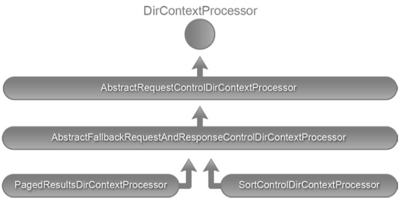

# Sorting and Paging Results

- LDAP 控件的基础知识。
- 对 LDAP 结果进行排序。
- 分页LDAP 结果。

## LDAP Controls

LDAP 控件提供了一种修改 LDAP 操作行为的标准化方法。控件可以简单地视为客户端发送到 LDAP 服务器的消息（反之亦然）。作为客户端请求的一部分发送的控件可以向服务器提供附加信息，指示应如何解释和执行操作。例如，可以在 LDAP 删除操作上指定删除子树控件。收到删除请求后，LDAP 服务器的默认行为是删除条目。但是，当删除子树控件附加到删除请求时，服务器会自动删除该条目及其所有从属条目。这种控制称为请求控制。
LDAP 服务器也可以发送控制作为其响应消息的一部分，指示如何处理操作。例如，LDAP 服务器可能会在绑定操作期间返回密码策略控制，指示客户端的密码已过期或即将过期。服务器发送的这种控制称为响应控制。可以随操作发送任意数量的请求或响应控件。

LDAP 控件，包括请求和响应，由以下三个组件组成：

- 唯一标识控件的对象标识符(OID)。这些 OID 可防止控件名称之间的冲突，并且通常由创建控件的供应商定义。这是控件的必需组件。
- 指示控制对于操作来说是关键的还是非关键的。这也是一个必需的组件，可以是 TRUE 或 FALSE。
- 特定于控件的可选信息。 例如，用于分页搜索结果的分页控件需要页面大小来确定要在页面中返回的条目数。

下面的清单显示了 RFC 2251 (www.ietf.org/rfc/rfc2251.txt) 中指定的 LDAP 控件的正式定义。 然而，这个 LDAP 规范没有定义任何具体的控制。 控制定义通常由 LDAP 供应商提供，它们的支持因服务器而异。

```txt
        Controls ::= SEQUENCE OF Control

        Control ::= SEQUENCE {
                controlType             LDAPOID,
                criticality             BOOLEAN DEFAULT FALSE,
                controlValue            OCTET STRING OPTIONAL }
```

当 LDAP 服务器接收到作为操作的一部分的控件时，其行为取决于该控件及其相关信息。 下图中的流程图显示了服务器在接收到请求控制时的行为。


图 7-1 LDAP 控制规范
| Control Name               | OID                        | Description (RFC)                                                                                                                                                                                                                   |
|----------------------------|----------------------------|-------------------------------------------------------------------------------------------------------------------------------------------------------------------------------------------------------------------------------------|
| Sort Control               | 1.2.840.113556.1.4.473     | Requests the server to sort the search results before sending them to client. This is part of RFC 2891.                                                                                                                             |
| Paged Results Control      | 1.2.840.113556.1.4.319     | Requests the server to return search results in pages consisting of specified number of entries. Only sequential iteration of the search results is allowed. This is defined as part of RFC 2696.                                   |
| Subtree Delete Control     | 1.2.840.113556.1.4.805     | Requests the server delete the entry and all its descendent entries.                                                                                                                                                                |
| Virtual List View Control  | 2.16.840.1.113730.3.4.9    | This is similar to Page search results but allows client request arbitrary subsets of entries. This control is described in the Internet Drafts file VLV 04.                                                                        |
| Password Policy Control    | 1.3.6.1.4.1.42.2.27.8.5.1  | Server-sent control that holds information about failed operation (authentication, for example) due to password policy problems such as password needs to be reset or account has been locked or password has expired or expiring.  |
| Manage DSA/IT Control      | 2.16.840.1.113730.3.4.2    | Requests the server to treat “ref” attribute entries (referrals) as regular LDAP entries.                                                                                                                                           |
| Persistent Search Control  | 2.16.840.1.113730.3.4.3    | This control allows the client to receive notifications of changes in the LDAP server for entries that match a search criteria.                                                                                                     |

### 识别支持的控件

在可以使用特定控件之前，确保您使用的 LDAP 服务器支持该控件非常重要。 LDAP 规范要求每个符合 LDAP v3 的服务器在根 DSA 特定条目 (DSE) 的 supportedControl 属性中发布所有受支持的控件。 因此，在根 DSE 条目中搜索supportedControl 属性将列出所有控件。 SupportedControlApplication.java 显示了连接到在端口 11389 上运行的 OpenDJ 服务器并将控制列表打印到控制台的代码。

OpenDJ 安装提供了一个命令行 ldapsearch 工具，该工具也可用于列出支持的控件。 下面是获取支持控件列表的命令：
`ldapsearch --baseDN "" --searchScope base --port 11389 "(objectclass=*)" supportedControl`
如下清单显示了运行此命令的结果。 请注意，为了搜索 Root DSE，您使用了作用域基础并且没有提供基础 DN。 此外，图中支持的控件 OID 与运行SupportedControlApplication.java 代码后收到的 OID 匹配。

```txt
supportedControl: 1.2.826.0.1.3344810.2.3
supportedControl: 1.2.840.113556.1.4.1413
...
```

### JNDI and Controls

JNDI API 中的 javax.naming.ldap 包包含对 LDAP V3 特定功能的支持，例如控件和扩展操作。 当控件修改或增加现有操作的行为时，扩展操作允许定义额外的操作。 下图中的 UML 图突出显示了 javax.naming.ldap 包中的一些重要控制类。


javax.naming.ldap.Control 接口为请求和响应控件提供了抽象。 此接口的几个实现，例如 SortControl 和 PagedResultsControl，作为 JDK 的一部分提供。 附加控件，例如 Virtual-ListViewControl 和 PasswordExpiringResponseControl，作为 LDAP 增强包的一部分提供。
javax.naming.ldap 包中的一个核心组件是 LdapContext 接口。 此接口扩展了 javax.naming.DirContext 接口并提供了用于执行 LDAP V3 操作的附加方法。 javax.naming.ldap 包中的 InitialLdapContext 类提供了该接口的具体实现。
通过 JNDI API 使用控件非常简单。 清单 7-2 中的代码提供了使用控件的算法。

```java
LdapContext context = new InitialLdapContext();
Control[] requestControls = // Concrete control instance array context.setRequestControls(requestControls);
/* Execute a search operation using the context*/ context.search(parameters);
Control[] responseControls = context.getResponseControls();
// Analyze the response controls
```

在此算法中，您首先创建要包含在请求操作中的控件的实例。 然后您执行操作并处理操作的结果。 最后，您分析服务器发送过来的任何响应控件。 在接下来的部分中，您将结合排序和分页控制来了解该算法的具体实现。

### Spring LDAP and Controls

在使用 LdapTemplate 的搜索方法时，Spring LDAP 不提供对目录上下文的访问。 因此，您无法将请求控件添加到上下文或处理响应控件。 为了解决这个问题，Spring LDAP 提供了一个目录上下文处理器，可以自动将 LDAP 控件添加和分析到上下文中。 清单 7-3 显示了 DirContextProcessor API 代码。

Listing 7-3.

```java
package org.springframework.ldap.core;
import javax.naming.NamingException; import javax.naming.directory.DirContext;
public interface DirContextProcessor {
   void preProcess(DirContext ctx) throws NamingException;
   void postProcess(DirContext ctx) throws NamingException;
}
```

DirContextProcessor 接口的具体实现被传递给 LdapTemplate 的搜索方法。 在执行搜索之前调用 preProcess 方法。 因此，具体的实现将在 preProcess 方法中具有将请求控件添加到上下文的逻辑。 postProcess 方法将在搜索执行后被调用。 因此，具体实现将在 postProcess 方法中包含逻辑来读取和分析 LDAP 服务器将发送的任何响应控件。
下图显示了 DirContextProcessor 及其所有实现的 UML 表示。



AbstractRequestControlDirContextProcessor 实现 DirContextProcessor 的 preProcess 方法，并在 LdapContext 上应用单个 RequestControl。 AbstractRequestDirContextProcessor 通过 createRequestControl 模板方法将请求控件的实际创建委托给子类。
AbstractFallbackRequestAndResponseControlDirContextProcessor 类扩展了 AbstractRequestControlDirContextProcessor 并大量使用反射来自动化 DirContext 处理。 它执行加载控制类、创建它们的实例并将它们应用到上下文的任务。 它还负责响应控件的大部分后处理，将模板方法委托给执行实际值检索的子类。
PagedResultsDirContextProcessor 和 SortControlDirContextProcessor 用于管理分页和排序控件。

## 排序控制

排序控件提供了一种机制来请求 LDAP 服务器在将搜索操作的结果发送到客户端之前对其进行排序。此控制在 RFC 2891 (<https://www.ietf.org/rfc/rfc2891.txt>) 中指定。排序请求控件接受一个或多个 LDAP 属性名称并将其提供给服务器以执行实际排序。
让我们看一下使用普通 JNDI API 的排序控件。SortingJndi.sortByLastName() 显示了按姓氏对所有搜索结果进行排序的代码。您首先创建 javax.naming.ldap.SortControl 的一个新实例，并为它提供 sn 属性，表明您打算按姓氏排序。您还通过向同一个构造函数提供 CRITICAL 标志来表明这是一个关键控件。然后使用 setRequestControls 方法将此请求控件添加到上下文中，并执行 LDAP 搜索操作。然后循环返回的结果并将它们打印到控制台。最后，您查看响应控件。排序响应控件保存排序操作的结果。如果服务器未能对结果进行排序，则通过抛出异常来表明这一点。

现在让我们看看使用 Spring LDAP 实现相同的排序行为。 SpringSorting.sortByLastName() 显示了相关的代码。 在这个实现中，您首先创建一个新的 org.springframework.ldap.control.SortControlDirContextProcessor 实例。
SortControlDirContextProcessor 构造函数采用 LDAP 属性名称
应该在控件创建期间用作排序键。 下一步是创建 SearchControls 和过滤器来限制搜索。 最后，调用 search 方法，传入创建的实例和映射器来映射数据。

### 实现自定义 DirContextProcessor

从 Spring LDAP 1.3.2 开始，SortControlDirContextProcessor 只能用于对一个 LDAP 属性进行排序。然而，JNDI API 允许您对多个属性进行排序。由于在某些情况下您希望根据多个属性对搜索结果进行排序，让我们实现一个新的 DirContextProcessor，它允许您在 Spring LDAP 中执行此操作。
到目前为止，您已经看到，排序操作需要一个请求控件并将发送一个响应控件。所以实现这个功能最简单的方法是扩展 AbstractFallbackRequestAndResponseControlDirContextProcessor。SortMultipleControlDirContextProcessor.java 显示了具有空抽象方法实现的初始代码。正如您将看到的，您正在使用三个实例变量来保存控件的状态。顾名思义，sortKeys 将保存您将对其进行排序的属性名称。 sorted 和 resultCode 变量将保存从响应控件中提取的信息。

下一步是向 AbstractFallbackRequestAndResponseControlDirContextProcessor 提供必要的信息以加载控件。 AbstractFallbackRequestAndResponseControlDirContextProcessor 需要来自子类的两条信息：要使用的请求和响应控件的完全限定类名，以及应该用作后备的控件的完全限定类名。  SortMultipleControlDirContextProcessor(String ... sortKeys) 显示了执行此操作的构造函数代码。

请注意，您已经提供了 JDK 附带的控件类作为要使用的默认控件，以及 LDAP 增强包附带的控件作为回退控件。 在构造函数的最后一行，您指示 AbstractFallbackRequestAndResponseControlDirContextProcessor 类将类加载到 JVM 中以供使用。
该过程的下一步是提供 createRequestControl() 方法的实现。 由于超类 AbstractFallbackRequestAndResponseControlDirContextProcessor 将负责控件的实际创建，因此您需要做的就是提供创建控件所需的信息。

实施的最后一步是分析响应控制并检索有关已完成操作的信息。 handleResponse() 显示了所涉及的代码。 请注意，您正在使用反射从响应控件中检索排序和结果代码信息。

现在您已经创建了一个允许您对多个属性进行排序的新 DirContextProcessor 实例，让我们试一试。 SpringSorting.sortByLocation() 显示了一个使用 SortMultipleControlDirContextProcessor 的排序方法。 该方法使用属性 st 和 l 对结果进行排序。

## 分页搜索控件

分页结果控件允许 LDAP 客户端控制返回 LDAP 搜索操作结果的速率。 LDAP 客户端创建具有指定页面大小的页面控件并将其与搜索请求相关联。 收到请求后，LDAP 服务器会以块的形式返回结果，每个块包含指定数量的结果。 在处理大型目录或构建具有分页功能的搜索应用程序时，分页结果控件非常有用。 此控件在 RFC 2696 (<http://www.ietf.org/rfc/rfc2696.txt>) 中进行了描述。
下图描述了 LDAP 客户端和服务器之间使用页面控件的交互。


> 注意 ldAP 服务器经常使用 sizeLimit 指令来限制搜索操作返回的结果数量。 如果搜索产生的结果多于指定的 sizeLimit，则会引发超出大小限制的异常 javax.naming.SizeLimitExceededException。 分页方法不允许您通过此限制。

作为第一步，LDAP 客户端将搜索请求与页面控件一起发送。 LDAP 服务器收到请求后，执行搜索操作并返回第一页结果。 此外，它还会发送一个 cookie，该 cookie 需要用于请求下一个分页结果集。 此 cookie 使 LDAP 服务器能够维护搜索状态。 客户不得对 cookie 的内部结构做出任何假设。 当客户端请求下一批结果时，它会发送相同的搜索请求和页面控制以及 cookie。 服务器以新的结果集和新的 cookie 进行响应。 当没有更多的搜索结果要返回时，服务器会发送一个空 cookie。
使用分页搜索控件的分页是单向和连续的。 客户端不可能在页面之间跳转或返回。 现在您已经了解了分页控件的基础知识，PagingJndi.java 展示了它使用普通 JNDI API 的实现。

pageAllPatrons() 中，您通过获取 LDAP 服务器上的上下文来开始实现。 然后创建 PagedResultsControl 并将页面大小指定为其构造函数参数。 您将控件添加到上下文并执行搜索操作。 然后循环搜索结果并在控制台上显示信息。 作为下一步，您将检查响应控件以识别服务器发送的 PagedResultsResponseControl。 从该控件中，您可以提取 cookie 和该搜索的估计结果总数。 结果计数是可选信息，服务器可以简单地返回零，指示未知计数。 最后，使用页面大小和 cookie 作为其构造函数参数创建一个新的 PagedResultsControl。 重复此过程，直到服务器发送一个空 (null) cookie 指示没有更多结果要处理。

Spring LDAP 抽象了清单 7-10 中的大部分代码，并使用 PagedResultsDirContextProcessor 轻松处理页面控件。 SpringPaging.pagedResults() 显示了 Spring LDAP 代码。

在此实现中，您使用页面大小和 cookie 创建 PagedResultsDirContextProcessor。 请注意，您正在使用 org.springframework.ldap.control.PagedResultsCookie 类来抽象服务器发送的 cookie。 cookie 值最初以 null 开头。 然后执行搜索并遍历结果。 服务器发送的 cookie 是从 DirContextProcessor 中提取的，用于检查未来的搜索请求。 您还使用 LastNameMapper 类从结果上下文中提取姓氏。 SpringPaging.java 中的 private class LastNameMapper 给出了 LastNameMapper 类的实现。
