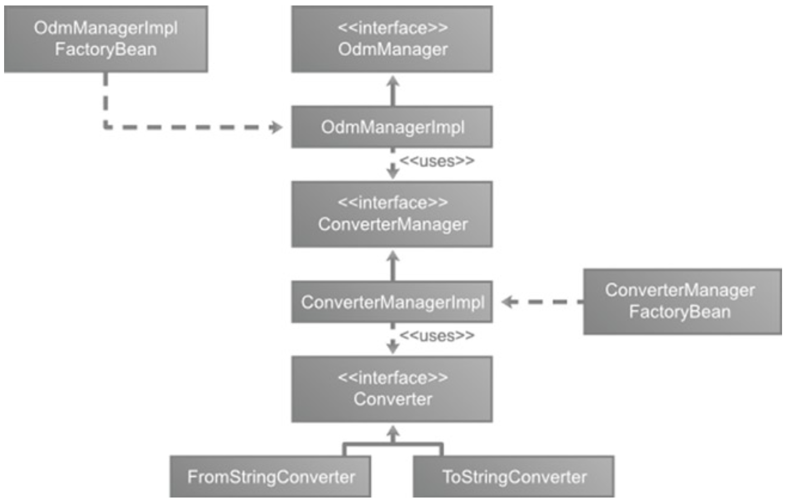
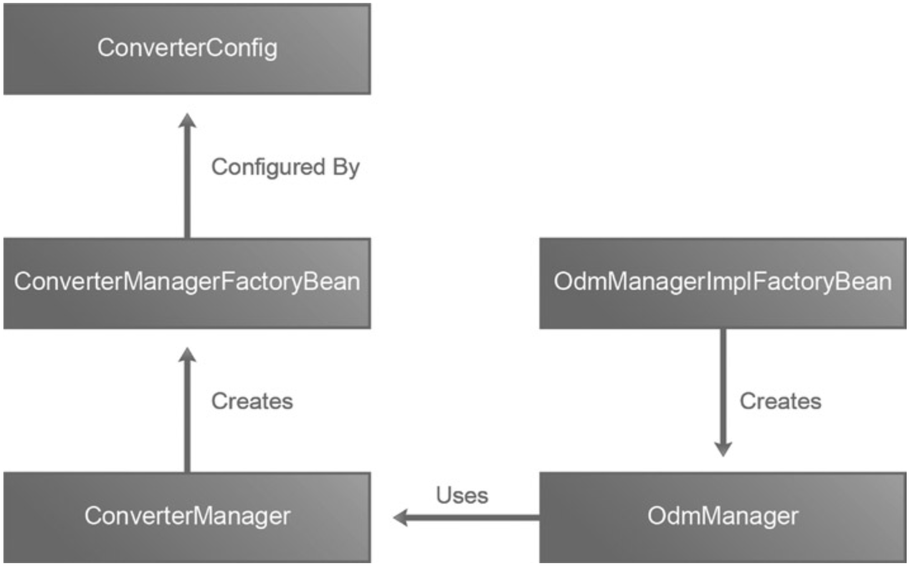

# Object-Directory Mapping

- ODM 的基础知识。
- Spring LDAP ODM 实施。
企业 Java 开发人员采用面向对象 (OO) 技术来创建模块化的复杂应用程序。在 OO 范式中，对象是系统的中心，代表现实世界中的实体。每个对象都有一个身份、状态和行为。对象可以通过继承或组合与其他对象相关联。另一方面，LDAP 目录以分层树结构表示数据和关系。这种差异会导致对象-目录范式不匹配，并可能导致 OO 和目录环境之间的通信出现问题。
Spring LDAP 提供了一个 Object-Directory Mapping (ODM) 框架，它在对象和目录模型之间架起了一座桥梁。 ODM 框架允许我们在两个模型之间映射概念，并协调将 LDAP 目录条目自动转换为 Java 对象的过程。 ODM 类似于更熟悉的对象关系映射 (ORM) 方法，它弥合了对象和关系数据库世界之间的差距。 Hibernate 和 Toplink 等框架使 ORM 变得流行，并成为开发人员工具集的重要组成部分。
尽管 Spring LDAP ODM 与 ORM 共享相同的概念，但它确实有以下区别：
- 无法缓存 LDAP 条目。
- ODM 元数据通过类级别的注释来表达。
- 没有可用的 XML 配置。
- 不能延迟加载条目。
- HQL 等查询语言不存在。对象的加载是通过 DN 查找和标准 LDAP 搜索查询完成的。

## Spring ODM 基础知识

Spring LDAP ODM 作为独立于核心 LDAP 项目的模块分发。 要在项目中包含 Spring LDAP ODM，需要将以下依赖项添加到项目的 pom.xml 文件中：

```xml
<dependency>
    <groupId>org.springframework.ldap</groupId>
    <artifactId>spring-ldap-odm</artifactId>
    <version>${org.springframework.ldap.version}</version>
    <exclusions>
        <exclusion>
            <artifactId>commons-logging</artifactId>
            <groupId>commons-logging</groupId>
        </exclusion>
    </exclusions>
</dependency>
```

Spring LDAP ODM 在 org.springframework.ldap.odm 包及其子包下可用。 Spring LDAP ODM 的核心类如图所示。



LDAP ODM 的核心是提供通用搜索和 CRUD 操作的 OdmManager。 它充当中介并在 LDAP 条目和 Java 对象之间转换数据。 Java 对象被注释以提供转换元数据。 清单显示了 OdmManager API。

```java
Package org.springframeworkldap.odm.core;
import java.util.List;
import javax.naming.Name;
import javax.naming.directory.SearchControls;
public interface OdmManager {
   void create(Object entry);
   <T> T read(Class<T> clazz, Name dn);
   void update(Object entry);
   void delete(Object entry);
   <T> List<T> findAll(Class<T> clazz, Name base, SearchControls
   searchControls);
   <T> List<T> search(Class<T> clazz, Name base, String filter,
   SearchControls searchControls);
}
```

OdmManager 的创建、更新和删除方法采用 Java 对象并使用其中的信息来执行相应的 LDAP 操作。 read 方法采用两个参数，一个确定要返回的类型的 Java 类和一个用于查找 LDAP 条目的完全限定 DN。 OdmManager 可以看作是您在第 5 章中看到的 Generic DAO 模式的一个细微变化。
Spring LDAP ODM 提供了 OdmManager 的开箱即用实现，恰当地命名为 OdmManagerImpl。为了正常运行，OdmManagerImpl 使用以下三个对象：

- 用于与 LDAP 服务器通信的 ContextSource 实现。
- ConverterManager 实现，用于将 LDAP 数据类型转换为 Java 数据类型，反之亦然。
- 一组需要由ODM 实现管理的域类。
为了简化 OdmManagerImpl 实例的创建，框架提供了一个工厂 bean，OdmManagerImplFactoryBean。以下是创建 OdmManager 实例的必要配置：

```XML
<bean  id="odmManager" class="org.springframework.ldap.odm. core.impl.
OdmManagerImplFactoryBean">
    <property  name="converterManager" ref="converterManager"  />
    <property  name="contextSource" ref="contextSource" />
    <property  name="managedClasses">
        <set>
            <value>FULLY_QUALIFIED_CLASS_NAME</value>
        </set>
    </property>
</bean>
```

OdmManager 将 LDAP 属性到 Java 字段的转换管理（反之亦然）委托给 ConverterManager。 ConverterManager 本身依赖于一组 Converter 实例来进行实际的转换。 清单显示了 Converter 接口 API。 convert 方法接受一个对象作为其第一个参数，并将其转换为 toClass 参数指定的类型的实例。

```java
package org.springframework.ldap.odm.typeconversion.impl;
public interface Converter {
   <T> T convert(Object source, Class<T> toClass) throws Exception;
}
```

转换器的通用性使得创建特定的实现变得容易。 Spring LDAP ODM 提供了 Converter 接口的 ToStringConverter 实现，它将给定的源对象转换为字符串。 清单提供了 ToStringConverter API 实现。 如您所见，只需调用源对象的 toString 方法即可进行转换。

```java
package org.springframework.ldap.odm.typeconversion.impl.converters;
import org.springframework.ldap.odm.typeconversion.impl.Converter;
public final class ToStringConverter implements Converter {
   public <T> T convert(Object source, Class<T> toClass) {
      return toClass.cast(source.toString());
} }
```

这个实现的反面是 FromStringConverter，它将 java.lang.String 对象转换为任何指定的 toClass 类型。 清单 8-4 提供了 FromStringConverter API 实现。 转换器实现通过调用 toClass 参数的构造函数并传入 String 对象来创建一个新实例。 toClass 类型参数必须有一个接受单个 java.lang.String 类型参数的公共构造函数。 例如，FromStringConverter 可以将 String 数据转换为 Integer 或 Long 数据类型。

```java
package org.springframework.ldap.odm.typeconversion.impl.converters;
import java.lang.reflect.Constructor;
import org.springframework.ldap.odm.typeconversion.impl.Converter;
public final class FromStringConverter implements Converter {
   public <T> T convert(Object source, Class<T> toClass) throws Exception { 
      Constructor<T> constructor = toClass.getConstructor(java.lang.String.class); 
      return constructor.newInstance(source);
   }
}
```

这两个转换器类应该足以将大多数 LDAP 数据类型转换为常见的 Java 字段类型，例如 java.lang.Integer、java.lang.Byte 等，反之亦然。 清单 8-5 显示了创建 FromStringConverter 和 ToStringConverter 实例所涉及的 XML 配置。

```xml
<bean id="fromStringConverter" class="org.springframework.ldap.odm.
typeconversion.impl.converters.FromStringConverter" />
<bean id="toStringConverter" class="org.springframework.ldap.odm.
typeconversion.impl.converters.ToStringConverter" />
```

现在您已准备好创建一个 ConverterManager 实例并使用它注册上述两个转换器。 注册转换器包括指定转换器本身、指示转换器期望的源对象类型的 fromClass 和指示转换器将返回的类型的 toClass。 为了简化 Converter 注册过程，Spring ODM 提供了一个 ConverterConfig 类。 清单 8-6 显示了用于注册 toStringConverter 实例的 XML 配置。

```xml
<bean id="toStringConverter" class="org.springframework.ldap.odm.
typeconversion.impl.ConverterManagerFactoryBean$ConverterConfig">
   <property name="converter" ref="toStringConverter"/>
   <property name="fromClasses">
      <set>
         <value>java.lang.Integer</value>
      </set>
   </property>
   <property name="toClasses">
      <set>
         <value>java.lang.String</value>
      </set>
   </property>
</bean>
```

如您所见，ConverterConfig 是 org.springframework 的内部类。 ldap.odm.typeconversion.impl.ConverterManagerFactoryBean 类。 此配置告诉 ConverterManager 使用 toStringConverter bean 将 java.lang.Integer 类型转换为 String 类型。 在内部，转换器在使用以下算法计算的密钥下注册：
`key = fromClass.getName() + ":" + syntax + ":" + toClass. getName();`
有时您希望使用相同的转换器实例来转换多种数据类型。 例如，ToStringConverter 可用于转换其他类型，例如 java.lang.Long、java.lang.Byte、java.lang.Boolean 等。
为了解决这种情况，ConverterConfig 接受一组转换器可以处理的 from 和 to 类。 清单显示了接受多个 fromClass 的修改后的 ConverterConfig。

```xml
<bean id="toStringConverter" class="org.springframework.ldap.odm.
typeconversion.impl.ConverterManagerFactoryBean$ConverterConfig">
   <property name="converter" ref="toStringConverter" />
   <property name="fromClasses">
      <set>
         <value>java.lang.Byte</value>
         <value>java.lang.Integer</value>
         <value>java.lang.Boolean</value>
      </set>
   </property>
   <property name="toClasses">
      <set>
         <value>java.lang.String</value>
      </set>
   </property>
</bean>
```

上述 fromClasses 集中指定的每个类都将与 toClasses 集中的一个类配对，用于转换器注册。 因此，如果您指定 n fromClasses 和 m toClasses，它将导致转换器converter的 n*m 注册。 清单显示了 fromStringConverterConfig，它与之前的配置非常相似。

```xml
<bean id="fromStringConverterConfig" class="org.springframework.ldap.odm.
typeconversion.impl.ConverterManagerFactoryBean$ConverterConfig">
   <property name="converter" ref="fromStringConverter" />
   <property name="fromClasses">
      <set>
         <value>java.lang.String</value>
      </set>
   </property>
   <property name="toClasses">
      <set>
         <value>java.lang.Byte</value>
         <value>java.lang.Integer</value>
         <value>java.lang.Boolean</value>
      </set>
   </property>
</bean>
```

完成必要的转换器配置后，可以使用 ConverterManagerFactoryBean 创建新的 ConverterManager 实例。 清单显示了所需的 XML 声明。

```xml
<bean id="converterManager" class="org.springframework.ldap.odm.
typeconversion.impl.ConverterManagerFactoryBean">
   <property name="converterConfig">
      <set>
         <ref bean="fromStringConverterConfig"/>
         <ref bean="toStringConverterConfig"/>
      </set>
   </property>
</bean>
```

使用 ODM 框架所需的设置到此结束。 在接下来的部分中，您将了解对域类进行注释并将此配置用于 LDAP 读取和写入。 在你这样做之前，让我们回顾一下你到目前为止所做的事情（见图 8-2）。



OdmManager 内部工作原理:

1. OdmManager 实例由 OdmManagerImplFactoryBean 创建。
2. OdmManager 使用 ConverterManager 实例在 LDAP 和 Java 类型之间进行转换。
3. 对于从特定类型到另一种特定类型的转换，ConverterManager 使用转换器。
4. ConverterManager 实例由 ConverterManagerFactoryBean 创建。
5. ConverterManagerFactoryBean 使用 ConverterConfig 实例来简化 Converter 注册。 ConverterConfig 类采用 fromClasses、toClasses 和伴随关系的转换器。The ConverterConfig class takes the fromClasses, toClasses, and the converter that goes along with the relationship.

## ODM Metadata
