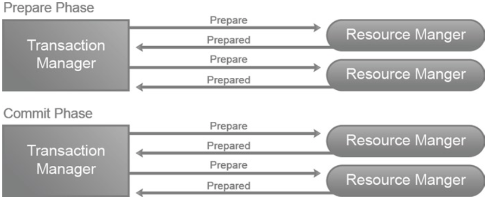
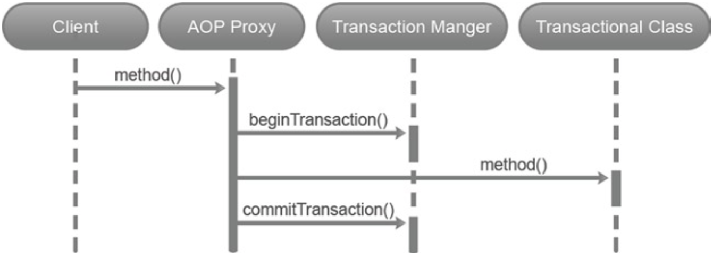
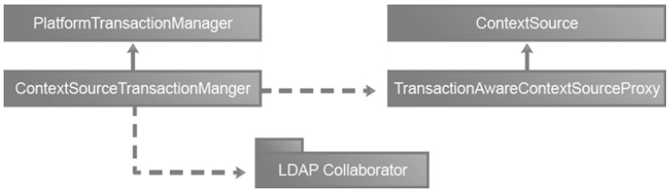

# LDAP Transactions

- 事务基础。
- Spring 事务抽象。
- Spring LDAP 对事务的支持。

## 事务基础

事务是企业应用程序的一个组成部分。简而言之，事务是一起执行的一系列操作。对于要完成或提交的事务，它的所有操作都必须成功。如果出于某种原因，一项操作失败，则整个事务将失败并回滚。在这种情况下，必须撤消所有先前成功的操作。这确保了结束状态与事务开始之前的状态相匹配。
在您的日常生活中，您总是会遇到交易。考虑一个在线银行场景，您希望将 300 美元从您的储蓄账户转移到您的支票账户。此操作包括从储蓄账户中借记 300 美元，并在支票账户中贷记 300 美元。如果操作的借记部分成功而贷记部分失败，您的合并账户最终将减少 300 美元。 （理想情况下，我们都希望借记操作失败而贷记操作成功，但银行可能会在第二天敲我们的门。）银行通过使用交易确保账户永远不会处于这种不一致的状态。
事务通常与以下四个众所周知的特征相关联，通常称为 ACID 属性：

- 原子性：此属性确保事务完全执行或根本不执行。所以在我们上面的例子中，我们要么成功转账，要么转账失败。这种全有或全无的属性也称为单个工作单元或逻辑工作单元。
- 一致性：此属性确保事务在完成后使系统处于一致状态。例如，对于数据库系统，这意味着满足所有完整性约束，例如主键或引用完整性。
- 隔离：此属性确保事务独立于其他并行事务执行。 尚未完成的事务的更改或副作用将永远不会被其他事务看到。 在转账场景中，账户的其他所有者只会看到转账前后的余额。 无论交易需要多长时间才能完成，他们将永远无法看到中间余额。 许多数据库系统放宽了这个属性并提供了几个级别的隔离。 下表列出了主要的事务级别和描述。 随着隔离级别的提高，事务并发性降低，事务一致性提高。
- 持久性：此属性确保已提交事务的结果不会因失败而丢失。 重新审视银行转账场景，当您收到转账成功的确认信息时，持久性属性确保此更改成为永久性的。

| Isolation Level  | Description                                                                                                                                                                                                                                                                                                                                                                                                           | 描述                                                                                                               |
|------------------|-----------------------------------------------------------------------------------------------------------------------------------------------------------------------------------------------------------------------------------------------------------------------------------------------------------------------------------------------------------------------------------------------------------------------|------------------------------------------------------------------------------------------------------------------|
| Read Uncommitted | This isolation level allows a running transaction to see changes made by other uncommitted transactions. Changes made by this transaction become visible to other transactions even before it completes. This is the lowest level of isolation and can more appropriately be considered as lack of isolation. Since it completely violates one of the ACID properties, it is not supported by most database vendors.  | 此隔离级别允许正在运行的事务查看其他未提交事务所做的更改。此事务所做的更改甚至在完成之前对其他事务可见。这是最低级别的隔离，可以更恰当地认为是缺乏隔离。由于它完全违反了 ACID 属性之一，因此大多数数据库供应商不支持它。  |
| Read Committed   | This isolation level allows a query in a running transaction to see only data committed before the query began. However, all uncommitted changes or changes committed by concurrent transactions during query execution will not be seen. This is the default isolation level for most databases including Oracle, MySQL, and PostgreSQL.                                                                             | 此隔离级别允许正在运行的事务中的查询仅查看在查询开始之前提交的数据。但是，不会看到查询执行期间所有未提交的更改或并发事务提交的更改。这是大多数数据库（包括 Oracle、MySQL 和 PostgreSQL）的默认隔离级别。 |
| Repeatable Read  | This isolation level allows a query in a running transaction to read the same data every time it is executed. To achieve this, the transaction acquires locks on all the rows examined (not just fetched) until it is complete.                                                                                                                                                                                       | 此隔离级别允许正在运行的事务中的查询在每次执行时读取相同的数据。为了实现这一点，事务在所有检查的行上获取锁（不仅仅是获取），直到它完成。                                             |
| Serializable     | This is the strictest and most expensive of all the isolation levels. Interleaving transactions are stacked up so that transactions are executed one after another rather than concurrently. With this isolation level, queries will only see the data that has been committed before the start of the transaction and will never see uncommitted changes or commits by concurrent transactions.                      | 这是所有隔离级别中最严格和最昂贵的。交错事务堆叠起来，以便事务一个接一个地执行，而不是同时执行。使用此隔离级别，查询将只能看到在事务开始之前已提交的数据，并且永远不会看到未提交的更改或并发事务的提交。             |

### Local vs. Global Transactions

根据参与事务的资源数量，事务通常分为本地事务或全局事务。这些资源的示例包括数据库系统或 JMS 队列。诸如 JDBC 驱动程序之类的资源管理器通常用于管理资源。
本地事务是涉及单个资源的事务。最常见的示例是与单个数据库关联的事务。这些事务通常通过用于访问资源的对象进行管理。在 JDBC 数据库事务的情况下，java.sql.Connection 接口的实现用于访问数据库。这些实现还提供了用于管理事务的提交和回滚方法。对于 JMS 队列，javax.jms.Session 实例提供了用于控制事务的方法。
另一方面，全局事务处理多个资源。例如，全局事务可用于从 JMS 队列中读取消息并将记录写入数据库，这一切都在一个事务中完成。
使用资源外部的事务管理器管理全局事务。它负责与资源管理器进行通信，并对分布式事务做出最终的提交或回滚决定。在 Java/JEE 中，全局事务是使用 Java Transaction API (JTA) 实现的。 JTA 为事务管理器和事务参与组件提供标准接口。
事务管理器采用“两阶段提交”协议来协调全局事务。顾名思义，两阶段提交协议有以下两个阶段：

- 准备阶段：在此阶段，询问所有参与的资源经理是否准备好提交工作。收到请求后，资源管理器会尝试记录其状态。如果成功，资源管理器会积极响应。如果它无法提交，资源管理器会做出否定响应并回滚本地更改。
- 提交阶段：如果事务管理器收到所有肯定响应，它会提交事务并通知所有参与者该提交。如果它收到一个或多个否定响应，它会回滚整个事务并通知所有参与者。

两阶段提交协议示意图



## Programmatic vs. Declarative Transactions

在向应用程序添加事务功能时，开发人员有两种选择。

### Programmatically 编程方式

在这种情况下，用于启动、提交或回滚事务的事务管理代码围绕着业务代码。 这可以提供极大的灵活性，但也会使维护变得困难。 以下代码给出了使用 JTA 和 EJB 3.0 的程序化事务示例：

```java
@Stateless 
@TransactionManagement(TransactionManagementType.BEAN)
public class OrderManager {
   @Resource
   private UserTransaction transaction;
   public void create(Order order) {
      try {
         transaction.begin();
         // business logic for processing order verifyAddress(order);
         processOrder(order); 
         sendConfirmation(order); 
         transaction.commit();
      }
      catch(Exception e) { 
         transaction.rollback();
      }
   } 
}
```

### Declaratively 声明式地

在这种情况下，容器负责启动、提交或回滚事务。 开发人员通常通过注释或 XML 指定事务行为。 该模型将事务管理代码与业务逻辑清晰地分开。 下面的代码给出了一个使用 JTA 和 EJB 3.0 的声明式事务的示例。 当订单处理过程中发生异常时，会调用会话上下文中的 setRollbackOnly 方法； 这标志着事务必须回滚。

```java
@Stateless 
@TransactionManagement(TransactionManagementType.CONTAINER)
public class OrderManager {
   @Resource
   private SessionContext context;
   @TransactionAttribute(TransactionAttributeType.REQUIRED)
   public void create(Order order) {
      try {
         // business logic for processing order
         verifyAddress(order);
         processOrder(order);
         sendConfirmation(order);
      }
      catch(Exception e) { 
         context.setRollbackOnly();
      }
   } 
}
```

## Spring事务抽象

Spring 框架为处理全局和本地事务提供了一致的编程模型。 事务抽象隐藏了不同事务 API（如 JTA、JDBC、JMS 和 JPA）的内部工作原理，并允许开发人员以与环境无关的方式编写启用事务的代码。 在幕后，Spring 只是将事务管理委托给底层事务提供者。 无需任何 EJB 即可支持编程式和声明式事务管理模型。 通常推荐使用声明式方法，这就是我们将在本书中使用的方法。

Spring 事务管理的核心是 PlatformTransactionManager 抽象。 它以独立于技术的方式公开了事务管理的关键方面。 它负责创建和管理事务，并且是声明性事务和程序化事务所必需的。 该接口的几个实现，例如 JtaTransactionManager、DataSourceTransactionManager 和 JmsTransactionManager，都是开箱即用的。 PlatformTransactionManager API 如清单所示。

```java
package org.springframework.transaction; public interface PlatformTransactionManager {
   TransactionStatus getTransaction(TransactionDefinition definition) throws
   TransactionException;
   void commit(TransactionStatus status) throws TransactionException;
   void rollback(TransactionStatus status) throws TransactionException;
   String getName();
}
```

PlatformTransactionManager 中的 getTransaction 方法用于检索现有事务。 如果未找到活动事务，则此方法可能会根据 TransactionDefinition 实例中指定的事务属性创建新事务。 以下是 TransactionDefinition 接口抽象的属性列表：

- 只读：此属性指示此事务是否为只读。
- 超时：此属性规定事务必须完成的时间。 如果事务未能在指定时间内完成，它将自动回滚。
- 隔离：此属性控制事务之间的隔离程度。
- 传播：考虑存在活动事务并且Spring 遇到需要在事务中执行的代码的场景。 在这种情况下，一种选择是在现有事务中执行代码。 另一种选择是暂停现有事务并启动新事务以执行代码。 传播属性可用于定义此类事务行为。 可能的值包括 PROPAGATION_REQUIRED、PROPAGATION_REQUIRES_NEW、PROPAGATION_SUPPORTS 等。

getTransaction 方法返回一个表示当前事务状态的 TransactionStatus 实例。 应用程序代码可以使用这个接口来检查这是否是一个新事务或者事务是否已经完成。 该接口还可用于以编程方式请求事务回滚。 PlatformTransactionManager 中的另外两个方法是提交和回滚，顾名思义，它们可用于提交或回滚事务。

## 使用 Spring 的声明式事务

Spring 提供了两种以声明方式向应用程序添加事务行为的方法：纯 XML 和注释。 注解方式非常流行，大大简化了配置。 为了演示声明性事务，请考虑在数据库的 Person 表中插入新记录的简单场景。 清单为 PersonRepositoryImpl 类提供了一个实现该场景的 create 方法。

```java
import org.springframework.jdbc.core.JdbcTemplate;
public class PersonRepositoryImpl implements PersonRepository {
   private JdbcTemplate jdbcTemplate;
   public void create(String firstName, String lastName) {
   String sql = "INSERT INTO PERSON (FIRST_NAME, " + "LAST_NAME) VALUES (?, ?)"; jdbcTemplate.update(sql, new Object[]{firstName, lastName});
} }
```

清单显示了上述类实现的 PersonRepository 接口。

```java
public interface PersonRepository {
   public void create(String firstName, String lastName);
}
```

下一步是使 create 方法具有事务性。 这可以通过简单地使用 @Transactional 注释方法来完成，如清单所示。 （请注意，注释了实现中的方法，而不是接口中的方法。）

```java
import org.springframework.transaction.annotation.Transactional;
public class PersonRepositoryImpl implements PersonRepository { 
   ...........
   @Transactional
   public void create(String firstName, String lastName) { 
   ...........
   }
}
```

@Transactional 注释有几个属性可用于指定附加信息，例如传播和隔离。 清单显示了具有默认隔离和 REQUIRES_NEW 传播的方法。

```java
@Transactional(propagation=Propagation.REQUIRES_NEW, isolation=Isolation.DEFAULT) 
public void create(String firstName, String lastName) {
}
```

下一步是指定 Spring 使用的事务管理器。 由于您要处理单个数据库，因此清单中显示的 org.springframework.jdbc.datasource.DataSourceTransactionManager 非常适合您的情况。 从清单中，您可以看到 DataSourceTransactionManager 需要一个数据源来获取和管理与数据库的连接。

```XML
<bean id="transactionManager" class="org.springframework.jdbc.datasource.DataSourceTransactionManager">
   <property name="dataSource" ref="dataSource"/> 
</bean>
```

清单给出了声明式事务管理的完整应用程序上下文配置文件。

```XML
<?xml version="1.0" encoding="UTF-8"?>
<beans xmlns="http://www.springframework.org/schema/beans"
xmlns:xsi="http://www.w3.org/2001/XMLSchema-instance"
xmlns:context="http://www.springframework.org/schema/context"
xmlns:tx="http://www.springframework.org/schema/tx"
xmlns:aop="http://www.springframework.org/schema/aop"
xsi:schemaLocation="http://www.springframework.org/schema/beans http://www.springframework.org/schema/beans/spring-beans.xsd http://www.springframework.org/schema/context http://www.springframework.org/schema/context/spring-context.xsd http://www.springframework.org/schema/tx http://www.springframework.org/schema/tx/spring-tx.xsd http://www.springframework.org/schema/aop http://www.springframework.org/schema/tx/spring-aop.xsd">
<bean id="transactionManager" class="org.springframework.jdbc.datasource.DataSourceTransactionManager">
<property name="dataSource" ref="dataSource"/> </bean>
<tx:annotation-driven transaction-manager="transactionManager"/>
<aop:aspectj-autoproxy /> </beans>
```

`<tx:annotation-driven/>` 标签表明您正在使用基于注释的事务管理。 这个标签与 `<aop:aspectj-autoproxy />` 一起指示 Spring 使用面向方面的编程 (AOP) 并创建代表带注释的类管理事务的代理。 因此，当调用事务方法时，代理会拦截调用并使用事务管理器获取事务（新的或现有的）。 然后调用被调用的方法，如果方法成功完成，使用事务管理器的代理将提交事务。 如果方法失败，抛出异常，事务将被回滚。 这种基于 AOP 的事务处理如图所示。



## LDAP 事务支持

LDAP 协议要求所有 LDAP 操作（例如修改或删除）都遵循 ACID 属性。这种事务行为确保了存储在 LDAP 服务器中的信息的一致性。但是，LDAP 没有定义跨多个操作的事务。考虑您希望将两个 LDAP 条目作为一个原子操作添加的场景。操作成功完成意味着两个条目都被添加到 LDAP 服务器。如果失败，其中一个条目无法添加，服务器会自动撤消另一个条目的添加。这种事务行为不是 LDAP 规范的一部分，也不存在于 LDAP 的世界中。此外，由于缺少提交和回滚等事务语义，因此无法确保跨多个 LDAP 服务器的数据一致性。
尽管事务不是 LDAP 规范的一部分，但 IBM Tivoli Directory Server 和 ApacheDS 等服务器提供事务支持。 IBM Tivoli Directory Server 支持的开始事务 (OID 1.3.18.0.2.12.5) 和结束事务 (OID 1.3.18.0.2.12.6) 扩展控件可用于划分事务内的一组操作。 RFC 5805 (<http://tools.ietf.org/html/rfc5805>) 尝试标准化 LDAP 中的事务，目前处于实验状态。

## Spring LDAP 事务支持

起初，LDAP 中缺少事务似乎令人惊讶。 更重要的是，它可以成为企业广泛采用目录服务器的障碍。 为了解决这个问题，Spring LDAP 提供了非 LDAP/JNDI 特定的补偿事务支持。 这种事务支持与您在前面部分中看到的 Spring 事务管理基础架构紧密集成。 图 9-3 显示了负责 Spring LDAP 事务支持的组件。



ContextSourceTransactionManager 类实现了 PlatformTransactionManager 并负责管理基于 LDAP 的事务。 这个类和它的协作者一起跟踪事务内部执行的 LDAP 操作，并记录每个操作之前的状态。 如果事务要回滚，事务管理器将采取措施恢复原始状态。 为实现此行为，事务管理器使用 TransactionAwareContextSourceProxy 而不是直接使用 LdapContextSource。 此代理类还确保在整个事务中使用单个 javax.naming.directory.DirContext 实例，并且在事务完成之前不会关闭。

## Compensating Transactions

补偿事务撤消先前提交的事务的影响并将系统恢复到先前的一致状态。考虑一个涉及预订机票的交易。该场景中的补偿事务是取消预订的操作。在 LDAP 的情况下，如果操作添加了新的 LDAP 条目，则相应的补偿事务只涉及删除该条目。
补偿事务对于不提供任何标准事务支持的资源（例如 LDAP 和 Web 服务）很有用。然而，重要的是要记住，补偿交易提供了一种错觉，永远不能取代真实的交易。因此，如果在补偿事务完成之前服务器崩溃或与 LDAP 服务器的连接丢失，您将得到不一致的数据。此外，由于事务已经提交，并发事务可能会看到无效数据。补偿事务可能会导致额外的开销，因为客户端必须处理额外的撤消操作。
为了更好地理解 Spring LDAP 事务，让我们创建一个具有事务行为的 Patron 服务。清单 PatronService.java 显示 create 方法的 PatronService 接口。

清单 PatronServiceImpl.java 展示了这个服务接口的实现。 create 方法实现只是将调用委托给 DAO 层。

请注意在类声明顶部使用 @Transactional 注释。 清单 PatronDao.java 和清单 PatronDaoImpl.java 分别显示了 PatronDao 接口及其实现 PatronDaoImpl。

从这两个清单可以看出，您按照第 5 章中讨论的概念创建了 Patron DAO 及其实现。下一步是创建一个 Spring 配置文件，该文件将自动装配组件并包含事务语义。 清单 repositoryContext-test.xml 给出了配置文件的内容。

在此配置中，您首先定义一个新的 LdapContextSource 并向其提供您的 LDAP 信息。到目前为止，您使用 id contextSource 引用了这个 bean，并将其注入以供 LdapTemplate 使用。但是，在这个新配置中，您将其称为 contextSourceTarget。然后配置 TransactionAwareContextSourceProxy 的实例并将 contextSource bean 注入其中。这个新配置的 TransactionAwareContextSourceProxy bean 具有 id contextSource 并由 LdapTemplate 使用。最后，您使用 ContextSourceTransactionManager 类配置事务管理器。如前所述，此配置允许在单个事务期间使用单个 DirContext 实例，从而启用事务提交/回滚。
有了这些信息，让我们验证您的创建方法和配置在事务回滚期间是否正确运行。为了模拟事务回滚，我们修改 PatronServiceImpl 类中的 create 方法添加 `throw new  RuntimeException();` 以抛出 RuntimeException。

验证预期行为的下一步是编写一个调用 PatronServiceImpl 的 create 方法的测试用例，以创建一个新的 Patron。 测试用例如清单 PatronServiceImplTest.java 所示。 repositoryContext-test.xml 文件包含清单中定义的 XML 配置。

当你运行测试时，Spring LDAP 应该创建一个新的赞助人； 然后，在回滚交易时，它将删除新创建的赞助人。 通过查看 OpenDJ 日志文件，可以看到 Spring LDAP 补偿事务的内部工作原理。 日志文件名为 access，位于 OPENDJ_INSTALL\logs 文件夹中。
清单显示了此创建操作的日志文件的一部分。 您会注意到，当调用 PatronDaoImpl 上的 create 方法时，会向 OpenDJ 服务器发送“ADD REQ”命令以添加新的 Patron 条目。 当 Spring LDAP 回滚事务时，会发送一个新的“DELETE REQ”命令来删除该条目。

```log
[14/Sep/2013:15:03:09 -0600] CONNECT conn=52 from=127.0.0.1:54792 to=127.0.0.1:11389 protocol=LDAP
[14/Sep/2013:15:03:09 -0600] BIND REQ conn=52 op=0 msgID=1 type=SIMPLE dn="cn=Directory Manager"
[14/Sep/2013:15:03:09 -0600] BIND RES conn=52 op=0 msgID=1 result=0 authDN="cn=Directory Manager,cn=Root DNs,cn=config" etime=0 [14/Sep/2013:15:03:09 -0600] ADD REQ conn=52 op=1 msgID=2 dn="uid=patron10001,ou=patrons,dc=inflinx,dc=com"
[14/Sep/2013:15:03:09 -0600] ADD RES conn=52 op=1 msgID=2 result=0 etime=2 [14/Sep/2013:15:03:09 -0600] DELETE REQ conn=52 op=2 msgID=3 dn="uid=patron10001,ou=patrons,dc=inflinx,dc=com"
[14/Sep/2013:15:03:09 -0600] DELETE RES conn=52 op=2 msgID=3 result=0 etime=4 [14/Sep/2013:15:03:09 -0600] UNBIND REQ conn=52 op=3 msgID=4 [14/Sep/2013:15:03:09 -0600] DISCONNECT conn=52 reason="Client Unbind"
```

该测试验证了 Spring LDAP 的补偿事务基础结构会在事务因任何原因回滚时自动删除新添加的条目。
现在让我们继续实现 PatronServiceImpl 方法并验证它们的事务行为。 添加删除方法到 PatronService 接口和 PatronServiceImpl 类。 同样，实际的删除方法实现很简单，只涉及调用 PatronDaoImpl 的删除方法。有了这段代码，让我们编写一个测试用例，在事务中调用您的删除方法。 PatronServiceImplTest.java 显示了测试用例。 “uid=patron98”是 OpenDJ 服务器中的现有条目，是在第 3 章的 LDIF 导入期间创建的。

当您运行此测试用例并在事务中调用 PatronServiceImpl 的 delete 方法时，Spring LDAP 的事务基础结构只是在新计算的临时 DN 下重命名条目。 本质上，通过重命名，Spring LDAP 将您的条目移动到 LDAP 服务器上的不同位置。 成功提交后，将删除临时条目。 在回滚时，该条目被重命名，因此将从临时位置移动到其原始位置。
现在，运行该方法并查看 OpenDJ 下的访问日志。 清单 9-19 显示了删除操作的日志文件部分。 请注意，删除操作会导致“MODIFYDN REQ”命令重命名要删除的条目。 成功提交后，通过“DELETE REQ”命令删除重命名的条目。

现在，让我们模拟 PatronServiceImpl 类中删除方法的回滚，添加 throw new RuntimeException() 语句。

现在，让我们使用您知道 OpenDJ 服务器中仍然存在的新 Patron Id 来更新测试用例。

运行此代码时，预期的行为是 Spring LDAP 将通过更改其 DN 来重命名 patron96 条目，然后在回滚时将其再次重命名为正确的 DN。 清单显示了上述操作的 OpenDJ 访问日志。 请注意，删除操作首先会通过发送第一个 MODIFYDN REQ 来重命名条目。 在回滚时，会发送第二个“MODIFYDN REQ”以将条目重命名回原始位置。

```log
[14/Sep/2013:16:33:43 -0600] CONNECT conn=55 from=127.0.0.1:54829 to=127.0.0.1:11389 protocol=LDAP
[14/Sep/2013:16:33:43 -0600] BIND REQ conn=55 op=0 msgID=1 type=SIMPLE dn="cn=Directory Manager"
[14/Sep/2013:16:33:43 -0600] BIND RES conn=55 op=0 msgID=1 result=0 authDN="cn=Directory Manager,cn=Root DNs,cn=config" etime=0 [14/Sep/2013:16:33:43 -0600] MODIFYDN REQ conn=55 op=1 msgID=2 dn="uid=patron96,ou=patrons,dc=inflinx,dc=com" newRDN="uid=patron96_temp" deleteOldRDN=true newSuperior="ou=patrons,dc=inflinx,dc=com [14/Sep/2013:16:33:43 -0600] MODIFYDN RES conn=55 op=1 msgID=2 result=0 etime=1
[14/Sep/2013:16:33:43 -0600] MODIFYDN REQ conn=55 op=2 msgID=3 dn="uid=patron96_temp,ou=patrons,dc=inflinx,dc=com" newRDN="uid=patron96" deleteOldRDN=true newSuperior="ou=patrons,dc=inflinx,dc=com [14/Sep/2013:16:33:43 -0600] MODIFYDN RES conn=55 op=2 msgID=3
result=0 etime=0
[14/Sep/2013:16:33:43 -0600] UNBIND REQ conn=55 op=3 msgID=4 [14/Sep/2013:16:33:43 -0600] DISCONNECT conn=55 reason="Client Unbind"
```

对于更新操作，您现在可以猜到，Spring LDAP 基础结构会计算对条目所做的修改的补偿 ModificationItem 列表。 在提交时，不需要做任何事情。 但是在回滚时，计算出的补偿 ModificationItem 列表将被写回。
